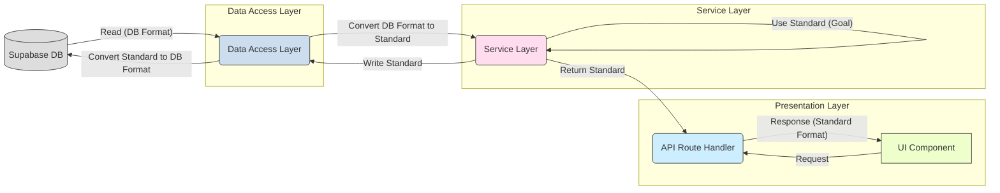

# 栄養データ型 標準化ガイドライン

## 1. 背景と目的

栄養素計算システムの再設計プロセスにおいて、複数の栄養データ型（特にレガシーな `NutritionData`, `BasicNutritionData`, `MealNutrient` と新しい標準型 `StandardizedMealNutrition`）が混在していました。このドキュメントは、`manmaru` アプリケーション内で使用する栄養データ型の標準を **`StandardizedMealNutrition` に統一することを目指し**、その役割と使用場面、そして**既存のレガシー型との共存・移行戦略**を明確にすることで、コードの可読性、保守性、および開発効率を向上させることを目的とします。

**フェーズ2の実装により、食事記録フロー（写真入力・テキスト入力）において `StandardizedMealNutrition` への移行が完了しました。このガイドラインは、残りの部分における現状と、引き続き目指すべき方向性を示しています。**

## 2. 標準データ型: `StandardizedMealNutrition`

**アプリケーション内部（サービス層、計算ロジック、UIコンポーネント等）で標準的に使用する栄養データ型として、`StandardizedMealNutrition` (`src/types/nutrition.ts` 内で定義) を使用します。**

### 2.1 採用理由と設計思想

`StandardizedMealNutrition` は、以下の設計思想に基づいて標準型として選定されました。

*   **構造化と明確性:**
    *   食事全体の総栄養素 (`totalNutrients`) と、それを構成する個々の食品アイテムの詳細 (`foodItems` および `FoodItemNutrition`) が明確に分離されています。これにより、データが「何を表しているか」が理解しやすくなります。
    *   例えば、総カロリーは `totalCalories` で直接アクセスでき、個々の食品（ごはん、味噌汁など）のカロリーは `foodItems` 配列内の各要素から取得できます。
*   **一貫性のある栄養素表現:**
    *   すべての栄養素データ（総量、食品ごと）が `Nutrient` 型 (`{ name: string; value: number; unit: string }`) の配列で表現されています。これにより、特定の栄養素（例: 鉄）にアクセスする際のコードが統一され、冗長性が排除されます。
    *   `NutritionData` のように栄養素ごとにプロパティを持つフラットな構造と比較して、新しい栄養素の追加・変更に対する拡張性が高くなっています。
*   **計算ロジックへの適合性:**
    *   食品ごとのデータ (`foodItems`) と全体の合計 (`totalNutrients`, `totalCalories`) が分離されているため、栄養バランスの評価や、特定の食品を除外した場合の再計算など、複雑な栄養計算ロジックの実装に適しています。
*   **再設計の目的との整合性:**
    *   型定義の不整合解消という再設計目標に最も合致するデータ構造です。

### 2.2 主要プロパティ解説

*   `totalCalories`: 食事全体の総エネルギー (kcal)。`NutritionData.calories` に相当。
*   `totalNutrients`: 食事全体の総栄養素リスト (`Nutrient[]`)。エネルギー、たんぱく質、脂質、炭水化物、ビタミン、ミネラルなど、すべての栄養素がこの配列に含まれます。
*   `foodItems`: 食事を構成する個々の食品アイテムのリスト (`FoodItem[]`)。
    *   各 `FoodItem` は、食品名 (`name`)、量 (`amount`, `unit`)、およびその食品自体の栄養情報 (`nutrition: FoodItemNutrition`) を持ちます。
    *   `FoodItemNutrition` も `calories` と `nutrients` (`Nutrient[]`) を含みます。
*   `pregnancySpecific` (オプショナル): 妊娠期特有の栄養充足率など（葉酸、鉄、カルシウムの充足率など）を格納します。
    *   **注意:** 現在、`convertToStandardizedNutrition` 関数ではこの値は計算されず、ダミーデータが設定されています。適切な計算ロジックの実装が必要です。
*   `reliability` (オプショナル): 栄養計算の信頼性スコアなどを格納します。

## 3. レガシーデータ型: `NutritionData`, `BasicNutritionData`, `MealNutrient` の位置づけ

`NutritionData`, `BasicNutritionData`, `MealNutrient` (`src/types/nutrition.ts` 内で定義) は、**コードベースの一部でまだ使用されているレガシーなデータ型**と位置づけます。`StandardizedMealNutrition` への移行が完了するまでの間、限定的な目的でのみ使用が許容されます。

### 3.1 レガシーである理由

*   **`NutritionData`:**
    *   **フラットな構造:** 主要な栄養素がトップレベルのプロパティとして定義されており、構造化されていません。
    *   **`extended_nutrients` への依存:** 基本6栄養素以外の多くの栄養素が `extended_nutrients` という JSONB 想定のネストしたオブジェクトに格納されており、アクセスが煩雑で型安全性も低くなります。
    *   **食品情報の欠如:** 食事全体の合計値しか保持できず、個々の食品 (`foodItems`) の情報を含めることができません。これにより、栄養計算の詳細な分析や再計算が困難です。
    *   **一貫性の欠如:** 栄養素の表現方法が統一されていません (例: `calories` はプロパティ、その他は `extended_nutrients` 内)。
*   **`BasicNutritionData`:**
    *   `NutritionData` のサブセットであり、同様の構造的問題を抱えています。主に概要表示などで使用されていました。
*   **`MealNutrient`:**
    *   `@deprecated` とマークされており、`StandardizedMealNutrition` 内の `foodItems` で代替されるべき型です。構造的な問題も抱えています。

### 3.2 許容される使用目的と現状

1.  **データベースへの永続化:**
    *   Supabase テーブルスキーマ (`meals.nutrition_data` など) が JSONB 構造を使用しているため、**データアクセス層 (リポジトリ/サービス) での読み書き時に型変換が必要**です。
    *   データを読み取る際には DB形式 → `StandardizedMealNutrition` へ、書き込む際には `StandardizedMealNutrition` → DB形式 (`convertToDbNutritionFormat`) へ変換します。
    *   **フェーズ2の実装により、`meal_nutrients` テーブルへの栄養データの書き込みは削除され、すべての栄養データは `meals.nutrition_data` カラム（JSONB型）に `StandardizedMealNutrition` 形式で保存されるようになりました。**
    *   **将来目標:** データベーススキーマも `StandardizedMealNutrition` の構造に最適化し、変換処理を簡素化します。
2.  **既存コードの互換性維持:**
    *   一部のサービス層、データアクセス層、カスタムフック、テストコードでは、依然として旧型が使用されています。
    *   **フェーズ2の実装により、食事記録フロー（写真入力・テキスト入力）では `StandardizedMealNutrition` への移行が完了しました。**
    *   残りの箇所も、**段階的に `StandardizedMealNutrition` を使用するようにリファクタリングする必要があります。**

**原則として、新規開発部分では `StandardizedMealNutrition` を使用してください。** 既存コードのリファクタリングを進め、旧型の使用箇所を削減していきます。

## 4. 開発ガイドライン: 型の使い分けと変換 (移行期)

以下に、アプリケーションの各レイヤーや処理におけるデータ型の基本的な扱い方を示します (**フェーズ2実装後のガイドライン**)。

1.  **サービス層 (NutritionService, MealService など):**
    *   内部ロジックでは **`StandardizedMealNutrition` を使用します。**
    *   **フェーズ2実装により、`MealService.saveMealWithNutrition` は `StandardizedMealNutrition` のみを受け付け、`meal_nutrients` テーブルへの書き込みを行わなくなりました。**
    *   残りのサービスメソッドでも、引数や戻り値は `StandardizedMealNutrition` を基準とします。

2.  **データアクセス層 (リポジトリ、例: `MealService` 内のDB操作部分):**
    *   **型変換の境界**となります。
    *   データベースから読み取ったデータを DB形式から **`StandardizedMealNutrition` に変換**してサービス層に返します。
    *   サービス層から受け取った `StandardizedMealNutrition` を **DB保存可能な形式に変換** してデータベースに書き込みます。
    *   **フェーズ2実装により、`StandardizedMealNutrition` 型のデータはそのまま `meals.nutrition_data` カラムに JSONB 形式で保存**されるようになり、変換が簡略化されました。

3.  **API Route Handlers (`/api/v2/...`):**
    *   サービス層から受け取った `StandardizedMealNutrition` をレスポンスの `data.nutrition` または `data.nutritionResult.nutrition` フィールドに設定します。
    *   後方互換性のための `legacyNutrition` フィールドを維持しつつも、クライアント側には `StandardizedMealNutrition` の使用を推奨します。
    *   リクエストのバリデーション (Zod) では、期待する入力形式を定義します。
    *   **フェーズ2実装により、`/api/v2/meal/text-analyze` と `/api/v2/meal/analyze` のレスポンスはともに一貫した `StandardizedMealNutrition` 形式を返すようになりました。**

4.  **UI コンポーネント (React):**
    *   Props として **`StandardizedMealNutrition` を受け取る**ようにします。
    *   **フェーズ2実装により、`enhanced-recognition-editor.tsx` などの主要なコンポーネントは `StandardizedMealNutrition` を使用**するようになりました。
    *   **テキスト入力と写真入力の両方で、データフローが `StandardizedMealNutrition` で統一**されました。

5.  **型変換ユーティリティ (`nutrition-type-utils.ts`, `nutrition-utils.ts`):**
    *   DBとの境界での型変換や、旧型と新標準型の間の変換が必要な場合は、**これらのファイル内の関連関数を利用**してください。
    *   `convertToStandardizedNutrition`: 旧形式 → `StandardizedMealNutrition`
    *   `convertToLegacyNutrition`: `StandardizedMealNutrition` → 旧形式 (後方互換性用)
    *   **フェーズ2実装により、写真入力とテキスト入力の保存フローではこれらの変換が不要になりました。**

6.  **データフロー (最新状態):**
    *   **テキスト入力フロー:**
        1. ユーザーが食品テキストを入力 → テキスト解析API (`/api/v2/meal/text-analyze`) → `StandardizedMealNutrition` 返却
        2. フロントエンドで `StandardizedMealNutrition` をそのまま使用して UI 表示
        3. 保存時に `StandardizedMealNutrition` をそのまま `/api/meals` に送信
        4. `meals.nutrition_data` カラムに `StandardizedMealNutrition` が JSONB 形式で保存
    
    *   **写真入力フロー:**
        1. ユーザーが写真をアップロード → 写真解析API (`/api/v2/meal/analyze`) → `StandardizedMealNutrition` 返却
        2. フロントエンドで `StandardizedMealNutrition` をそのまま使用して UI 表示
        3. 保存時に `StandardizedMealNutrition` をそのまま `/api/meals` に送信
        4. `meals.nutrition_data` カラムに `StandardizedMealNutrition` が JSONB 形式で保存

**図解: データフローと型変換 (フェーズ2実装後の現状)**

*図: 主要レイヤー間のデータフローと型変換のポイント（フェーズ2実装後の現状）*

## 5. 最終目標

アプリケーション全体で `StandardizedMealNutrition` が標準データ型として一貫して使用される状態を目指します。達成すべき目標は以下の通りです。

1.  API レスポンスから後方互換性のための旧型フィールド (`legacyNutrition` など) を削除します。
2.  `NutritionData`, `BasicNutritionData`, `MealNutrient` 型への変換処理 (`convertToLegacyNutrition` など) を、DB永続化のための変換を除き、削除します。
3.  サービス層、フック、コンポーネントなど、DB連携以外の箇所での旧型の直接使用をなくします。
4.  **[推奨]** データベーススキーマを `StandardizedMealNutrition` に合わせて最適化し、データアクセス層での変換を不要にします。
5.  最終的に、不要になった旧型の型定義 (`NutritionData`, `BasicNutritionData`, `MealNutrient`) そのものをコードベースから削除します。

これにより、シンプルで一貫性があり、保守性の高いコードベースを実現します。

## 6. フェーズ2実装の成果と今後の課題

フェーズ2での実装により、以下の成果が得られました：

1. 食事記録フロー（写真入力・テキスト入力）で `StandardizedMealNutrition` を一貫して使用するようになりました。
2. `meal_nutrients` テーブルへの書き込みが削除され、すべての栄養データは `meals.nutrition_data` カラムに格納されるようになりました。
3. 主要なUIコンポーネント（`EnhancedRecognitionEditor` など）は `StandardizedMealNutrition` を直接扱うようになりました。

今後の課題：

1. 栄養管理ダッシュボードでの `StandardizedMealNutrition` 使用への完全移行
2. レシピ関連機能での `StandardizedMealNutrition` 使用への移行
3. 使用されなくなった変換関数や、レガシーコードの整理・削除
4. データベースレイヤーでの型定義の最適化（より直接的な変換処理の実現）

## 7. 型定義ファイル内のヘルパー関数について

現在 `src/types/nutrition.ts` 内に存在するヘルパー関数 (`parseNutritionFromJson`, `serializeNutritionToJson`, `convertToNutrientDisplayData`) は、型定義ファイルの責務を超えています。

**推奨:** これらの関数は、専用のユーティリティファイル `src/lib/nutrition/nutrition-type-utils.ts` へ移動してください。（この作業は別タスクとして計画・実施することを推奨します）