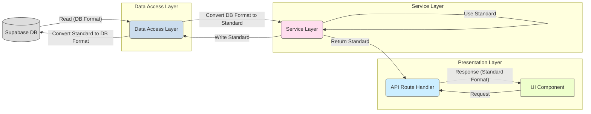

# 栄養データ型 標準化ガイドライン

## 1. 背景と目的

栄養素計算システムの再設計プロセスにおいて、複数の栄養データ型（特にレガシーな `NutritionData` と新しい標準型 `StandardizedMealNutrition`）が混在していました。このドキュメントは、`manmaru` アプリケーション内で使用する栄養データ型の標準を `StandardizedMealNutrition` に統一し、その役割と使用場面を明確にすることで、コードの可読性、保守性、および開発効率を向上させることを目的とします。

**このガイドラインは、型定義統一リファクタリングが完了した後の状態を反映しています。**

## 2. 標準データ型: `StandardizedMealNutrition`

**アプリケーション内部（サービス層、計算ロジック、UIコンポーネント等）で標準的に使用する栄養データ型として、`StandardizedMealNutrition` (`src/types/nutrition.ts` 内で定義) を採用しています。**

### 2.1 採用理由と設計思想

`StandardizedMealNutrition` は、以下の設計思想に基づいて標準型として選定されました。

*   **構造化と明確性:**
    *   食事全体の総栄養素 (`totalNutrients`) と、それを構成する個々の食品アイテムの詳細 (`foodItems` および `FoodItemNutrition`) が明確に分離されています。これにより、データが「何を表しているか」が理解しやすくなります。
    *   例えば、総カロリーは `totalCalories` で直接アクセスでき、個々の食品（ごはん、味噌汁など）のカロリーは `foodItems` 配列内の各要素から取得できます。
*   **一貫性のある栄養素表現:**
    *   すべての栄養素データ（総量、食品ごと）が `Nutrient` 型 (`{ name: string; value: number; unit: string }`) の配列で表現されています。これにより、特定の栄養素（例: 鉄）にアクセスする際のコードが統一され、冗長性が排除されます。
    *   `NutritionData` のように栄養素ごとにプロパティを持つフラットな構造と比較して、新しい栄養素の追加・変更に対する拡張性が高くなっています。
*   **計算ロジックへの適合性:**
    *   食品ごとのデータ (`foodItems`) と全体の合計 (`totalNutrients`, `totalCalories`) が分離されているため、栄養バランスの評価や、特定の食品を除外した場合の再計算など、複雑な栄養計算ロジックの実装に適しています。
*   **再設計の目的との整合性:**
    *   型定義の不整合解消という再設計目標に最も合致するデータ構造です。

### 2.2 主要プロパティ解説

*   `totalCalories`: 食事全体の総エネルギー (kcal)。`NutritionData.calories` に相当。
*   `totalNutrients`: 食事全体の総栄養素リスト (`Nutrient[]`)。エネルギー、たんぱく質、脂質、炭水化物、ビタミン、ミネラルなど、すべての栄養素がこの配列に含まれます。
*   `foodItems`: 食事を構成する個々の食品アイテムのリスト (`FoodItem[]`)。
    *   各 `FoodItem` は、食品名 (`name`)、量 (`amount`, `unit`)、およびその食品自体の栄養情報 (`nutrition: FoodItemNutrition`) を持ちます。
    *   `FoodItemNutrition` も `calories` と `nutrients` (`Nutrient[]`) を含みます。
*   `pregnancySpecific` (オプショナル): 妊娠期特有の栄養充足率など（葉酸、鉄、カルシウムの充足率など）を格納します。
    *   **注意:** 現在、`convertToStandardizedNutrition` 関数ではこの値は計算されず、ダミーデータが設定されています。適切な計算ロジックの実装が必要です。

## 3. レガシーデータ型: `NutritionData` の位置づけ

`NutritionData` (`src/types/nutrition.ts` 内で定義) は、**現在では限定的な目的でのみ使用されるレガシーなデータ型**と位置づけます。

### 3.1 レガシーである理由

*   **フラットな構造:** 主要な栄養素がトップレベルのプロパティとして定義されており、構造化されていません。
*   **`extended_nutrients` への依存:** 基本6栄養素以外の多くの栄養素が `extended_nutrients` という JSONB 想定のネストしたオブジェクトに格納されており、アクセスが煩雑で型安全性も低くなります。
*   **食品情報の欠如:** 食事全体の合計値しか保持できず、個々の食品 (`foodItems`) の情報を含めることができません。これにより、栄養計算の詳細な分析や再計算が困難です。
*   **一貫性の欠如:** 栄養素の表現方法が統一されていません (例: `calories` はプロパティ、その他は `extended_nutrients` 内)。

### 3.2 許容される使用目的

1.  **データベースへの永続化:**
    *   現在の Supabase テーブルスキーマ (`meals.nutrition_data` など) が `NutritionData` に近い JSONB 構造に依存しているため、**データアクセス層 (リポジトリ) での読み書き時に型変換**を行っています。
    *   データを読み取る際には DB形式 → `StandardizedMealNutrition` へ、書き込む際には `StandardizedMealNutrition` → DB形式 (`convertToDbNutritionFormat` などで変換) へ変換します。
    *   **将来目標:** データベーススキーマも `StandardizedMealNutrition` の構造に合わせて変更し、この変換処理を廃止します (リファクタリング計画 ステップ7の検討事項)。

**原則として、新規開発や主要なロジック内で `NutritionData` 型を直接扱うことはありません。** 既存のコードでも、`StandardizedMealNutrition` を使用するようにリファクタリングされています。

## 4. 開発ガイドライン: 型の使い分けと変換

以下に、アプリケーションの各レイヤーや処理におけるデータ型の基本的な扱い方を示します。

1.  **サービス層 (NutritionService, MealService など):**
    *   内部ロジックでは原則として **`StandardizedMealNutrition` を使用**します。
    *   メソッドの引数や戻り値も `StandardizedMealNutrition` (またはその一部) を基準とします。
2.  **データアクセス層 (リポジトリ、例: `MealService` 内のDB操作部分):**
    *   データベースとのインターフェースとなるため、**型変換の境界**となります。
    *   データベースから読み取ったデータを DB形式から **`StandardizedMealNutrition` に変換**してサービス層に返します。
    *   サービス層から受け取った `StandardizedMealNutrition` を **DB保存可能な形式 (`convertToDbNutritionFormat` 等で変換)** してデータベースに書き込みます。
3.  **API Route Handlers (`/api/v2/...`):**
    *   サービス層から受け取った `StandardizedMealNutrition` をレスポンスの `data.nutrition` フィールドなどに設定します。
    *   後方互換性のための `legacyNutrition` フィールドは削除されました。
    *   リクエストのバリデーション (Zod) では、期待する入力形式を定義します。
4.  **UI コンポーネント (React):**
    *   全てのコンポーネントは、Props として **`StandardizedMealNutrition` を受け取る**ように修正されています。
5.  **型変換ユーティリティ (`nutrition-type-utils.ts`):**
    *   DBとの境界での型変換が必要な場合は、**必ずこのファイル内の関連関数 (`convertToStandardizedNutrition`, `convertToDbNutritionFormat` など) を利用**してください。これにより、変換ロジックが一元管理され、一貫性が保たれます。
    *   `convertToLegacyNutrition` など、旧型への変換関数は不要になったため削除されました (リファクタリング計画 ステップ5で実施済み)。

**図解: データフローと型変換**

*図: 主要レイヤー間のデータフローと型変換のポイント（統一後）*

## 5. 最終目標

アプリケーション全体で `StandardizedMealNutrition` が標準データ型として一貫して使用されるようになりました。今後の目標は以下の通りです。

1.  ~~API レスポンスから `legacyNutrition` フィールドを削除します。~~ (完了)
2.  ~~`NutritionData` 型への変換処理 (`convertToLegacyNutrition` など) を削除します。~~ (完了)
3.  データベーススキーマを `StandardizedMealNutrition` に合わせて最適化し、データアクセス層での変換を不要にします。
4.  最終的に、`NutritionData` 型定義そのものをコードベースから削除します。

これにより、シンプルで一貫性があり、保守性の高いコードベースを実現します。

## 6. 型定義ファイル内のヘルパー関数について

現在 `src/types/nutrition.ts` 内に存在するヘルパー関数 (`parseNutritionFromJson`, `serializeNutritionToJson`, `convertToNutrientDisplayData`) は、型定義ファイルの責務を超えています。

**推奨:** これらの関数は、別途 `src/lib/nutrition/nutrition-type-utils.ts` のような専用のユーティリティファイルを作成し、そちらへ移動してください。（この作業は別タスクとして計画・実施することを推奨します）
