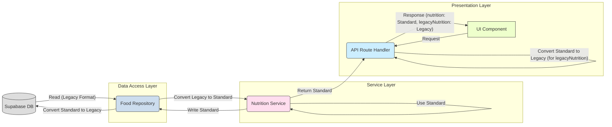

# 栄養データ型 標準化ガイドライン

## 1. 背景と目的

栄養素計算システムの再設計プロセスにおいて、複数の栄養データ型（特にレガシーな `NutritionData` と新しい標準型 `StandardizedMealNutrition`）が混在し、開発時の混乱やコードの一貫性の低下を招く可能性が明らかになりました。

このドキュメントは、`manmaru` アプリケーション内で使用する栄養データ型の標準を定義し、それぞれの役割と使用場面を明確にすることで、型定義の不整合を解消し、コードの可読性、保守性、および開発効率を向上させることを目的とします。

## 2. 標準データ型: `StandardizedMealNutrition`

**アプリケーション内部（サービス層、計算ロジック、新規UIコンポーネント等）で標準的に使用する栄養データ型として、`StandardizedMealNutrition` (`src/types/nutrition.ts` 内で定義) を採用します。**

### 2.1 採用理由と設計思想

`StandardizedMealNutrition` は、以下の設計思想に基づいて標準型として選定されました。

*   **構造化と明確性:**
    *   食事全体の総栄養素 (`totalNutrients`) と、それを構成する個々の食品アイテムの詳細 (`foodItems` および `FoodItemNutrition`) が明確に分離されています。これにより、データが「何を表しているか」が理解しやすくなります。
    *   例えば、総カロリーは `totalCalories` で直接アクセスでき、個々の食品（ごはん、味噌汁など）のカロリーは `foodItems` 配列内の各要素から取得できます。
*   **一貫性のある栄養素表現:**
    *   すべての栄養素データ（総量、食品ごと）が `Nutrient` 型 (`{ name: string; value: number; unit: string }`) の配列で表現されています。これにより、特定の栄養素（例: 鉄）にアクセスする際のコードが統一され、冗長性が排除されます。
    *   `NutritionData` のように栄養素ごとにプロパティを持つフラットな構造と比較して、新しい栄養素の追加・変更に対する拡張性が高くなっています。
*   **計算ロジックへの適合性:**
    *   食品ごとのデータ (`foodItems`) と全体の合計 (`totalNutrients`, `totalCalories`) が分離されているため、栄養バランスの評価や、特定の食品を除外した場合の再計算など、複雑な栄養計算ロジックの実装に適しています。
*   **再設計の目的との整合性:**
    *   型定義の不整合解消という再設計目標に最も合致するデータ構造です。

### 2.2 主要プロパティ解説

*   `totalCalories`: 食事全体の総エネルギー (kcal)。`NutritionData.calories` に相当。
*   `totalNutrients`: 食事全体の総栄養素リスト (`Nutrient[]`)。エネルギー、たんぱく質、脂質、炭水化物、ビタミン、ミネラルなど、すべての栄養素がこの配列に含まれます。
*   `foodItems`: 食事を構成する個々の食品アイテムのリスト (`FoodItem[]`)。
    *   各 `FoodItem` は、食品名 (`name`)、量 (`amount`, `unit`)、およびその食品自体の栄養情報 (`nutrition: FoodItemNutrition`) を持ちます。
    *   `FoodItemNutrition` も `calories` と `nutrients` (`Nutrient[]`) を含みます。
*   `pregnancySpecific` (オプショナル): 妊娠期特有の栄養充足率など（葉酸、鉄、カルシウムの充足率など）を格納します。
    *   **注意:** 現在、`convertToStandardizedNutrition` 関数ではこの値は計算されず、ダミーデータが設定されています。適切な計算ロジックの実装が必要です。

## 3. レガシーデータ型: `NutritionData` の位置づけ

`NutritionData` (`src/types/nutrition.ts` 内で定義) は、**移行期間中の限定的な目的でのみ使用が許容されるレガシーなデータ型**と位置づけます。

### 3.1 レガシーである理由

*   **フラットな構造:** 主要な栄養素がトップレベルのプロパティとして定義されており、構造化されていません。
*   **`extended_nutrients` への依存:** 基本6栄養素以外の多くの栄養素が `extended_nutrients` という JSONB 想定のネストしたオブジェクトに格納されており、アクセスが煩雑で型安全性も低くなります。
*   **食品情報の欠如:** 食事全体の合計値しか保持できず、個々の食品 (`foodItems`) の情報を含めることができません。これにより、栄養計算の詳細な分析や再計算が困難です。
*   **一貫性の欠如:** 栄養素の表現方法が統一されていません (例: `calories` はプロパティ、その他は `extended_nutrients` 内)。

### 3.2 許容される使用目的（移行期間中）

1.  **データベースへの永続化:**
    *   現在の Supabase テーブルスキーマが `NutritionData` の構造（フラットなカラム）に依存しているため、**データアクセス層 (リポジトリ) での読み書き時に一時的に使用**します。
    *   データを読み取る際には `NutritionData` → `StandardizedMealNutrition` へ、書き込む際には `StandardizedMealNutrition` → `NutritionData` への変換が必要です。
    *   **将来目標:** データベーススキーマも `StandardizedMealNutrition` に合わせて変更し、この目的での使用を廃止します (フェーズ5の検討事項)。
2.  **後方互換性の維持:**
    *   v2 API のレスポンスにおいて、`StandardizedMealNutrition` (`nutrition` フィールド) と併記する形で `legacyNutrition` フィールドとして提供します。これは、まだ新しい形式に対応できていないフロントエンドコンポーネントや旧システムとの互換性を維持するための**暫定措置**です。
    *   フロントエンド等の移行が完了次第、API レスポンスから `legacyNutrition` フィールドは削除します。
    *   まだ `StandardizedMealNutrition` に対応していない既存の内部関数やコンポーネントとの境界でも、一時的に使用する可能性がありますが、速やかなリファクタリングが推奨されます。

**原則として、新規開発や主要なロジック内で `NutritionData` を直接扱うことは避けてください。**

## 4. 開発ガイドライン: 型の使い分けと変換

以下に、アプリケーションの各レイヤーや処理におけるデータ型の使い分けと、型変換の指針を示します。

1.  **サービス層 (NutritionService, AIService など):**
    *   内部ロジックでは原則として **`StandardizedMealNutrition` を使用**します。
    *   メソッドの引数や戻り値も可能な限り `StandardizedMealNutrition` (またはその一部) を基準とします。
    *   ただし、`NutritionService` が `FoodRepository` からデータを取得する際は、リポジトリが返す `NutritionData` (またはそれに準ずる型) を受け取り、内部で `StandardizedMealNutrition` に変換、あるいは計算結果を `StandardizedMealNutrition` として生成します。
2.  **データアクセス層 (FoodRepository など):**
    *   データベースとのインターフェースとなるため、**型変換の境界**となります。
    *   データベースから読み取ったデータを `NutritionData` (またはDBスキーマ対応型) から **`StandardizedMealNutrition` に変換**してサービス層に返します。
    *   サービス層から受け取った `StandardizedMealNutrition` を **`NutritionData` (またはDBスキーマ対応型) に変換**してデータベースに書き込みます。
3.  **API Route Handlers (`/api/v2/...`):**
    *   サービス層から受け取った `StandardizedMealNutrition` をレスポンスの `data.nutrition` フィールドに設定します。
    *   後方互換性のため、サービス層から受け取ったデータ (または `StandardizedMealNutrition` から変換したデータ) を `NutritionData` 形式で `data.legacyNutrition` フィールドにも設定します (移行期のみ)。
    *   リクエストのバリデーション (Zod) では、期待する入力形式を定義します。
4.  **UI コンポーネント (React):**
    *   **新規作成または改修**するコンポーネントは、Props として **`StandardizedMealNutrition` を受け取る**ように設計します。
    *   既存のコンポーネントが `NutritionData` を期待している場合は、データ取得層 (カスタムフックなど) またはコンポーネントの境界で `legacyNutrition` を参照するか、`convertToLegacyNutrition` を用いて変換します。ただし、これは**一時的な措置**とし、コンポーネント自体の改修を目指します。
5.  **型変換ユーティリティ (`nutrition-type-utils.ts`):**
    *   型変換が必要な場合は、**必ずこのファイル内の関数 (`convertToStandardizedNutrition`, `convertToLegacyNutrition`) を利用**してください。これにより、変換ロジックが一元管理され、一貫性が保たれます。
    *   これらの関数は、データ構造の違いを吸収する役割を担います。変換時に情報が失われる可能性があること (例: `NutritionData` から `StandardizedMealNutrition` への変換では `foodItems` は生成できない) に留意してください。

**図解: データフローと型変換**

*図: 主要レイヤー間のデータフローと型変換のポイント*

## 5. 最終目標

アプリケーション全体で `StandardizedMealNutrition` が標準データ型として一貫して使用され、フロントエンドの移行が完了した暁には、

1.  API レスポンスから `legacyNutrition` フィールドを削除します。
2.  `NutritionData` 型への変換処理 (`convertToLegacyNutrition` など) を削除します。
3.  データベーススキーマを `StandardizedMealNutrition` に合わせて最適化し、データアクセス層での変換を不要にします。
4.  最終的に、`NutritionData` 型定義そのものをコードベースから削除します。

これにより、シンプルで一貫性があり、保守性の高いコードベースを実現します。

## 6. 型定義ファイル内のヘルパー関数について

現在 `src/types/nutrition.ts` 内に存在するヘルパー関数 (`parseNutritionFromJson`, `serializeNutritionToJson`, `convertToNutrientDisplayData`) は、型定義ファイルの責務を超えています。

**推奨:** これらの関数は、別途 `src/lib/nutrition/nutrition-type-utils.ts` のような専用のユーティリティファイルを作成し、そちらへ移動してください。（この作業は別タスクとして計画・実施することを推奨します）
