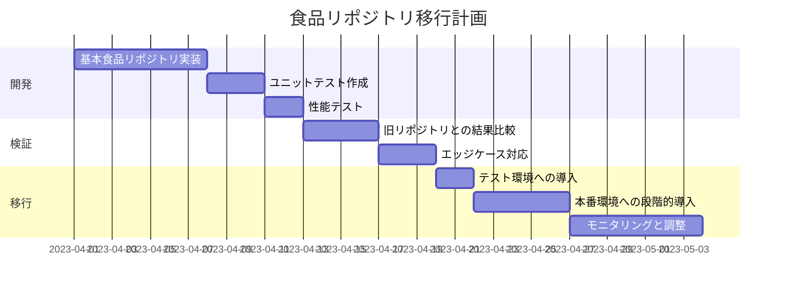
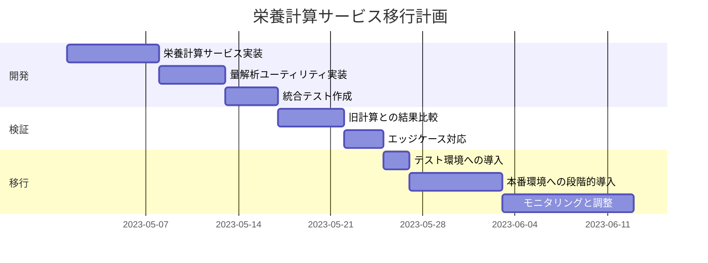
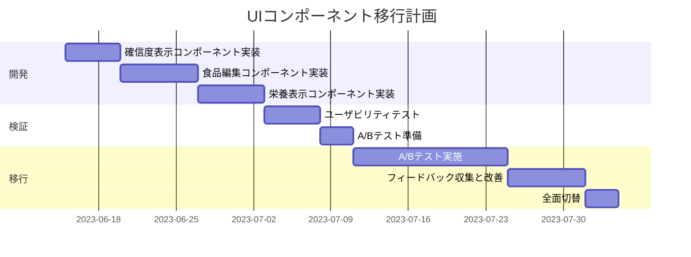
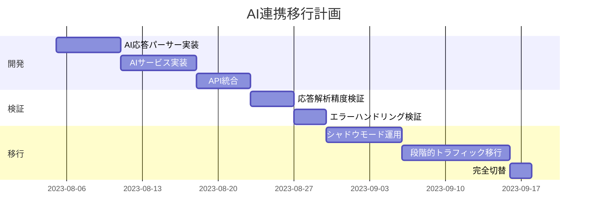

# マイグレーション計画

## 1. 段階的移行アプローチ

### 1.1 移行の基本方針

新しい栄養素計算システムへの移行は、システムの安定性を確保しながら段階的に行います。以下の原則に基づいて移行を進めます：

1. **並行運用期間**：新旧システムを一定期間並行して動作させる
2. **機能単位の切り替え**：個々の機能単位で新システムに切り替える
3. **精度検証**：各移行ステップで栄養計算精度を検証
4. **フィードバックループ**：ユーザーフィードバックを収集し改善に活かす
5. **リバーシビリティ**：問題が発生した場合に旧システムに戻せる仕組み

### 1.2 移行フェーズ

| フェーズ | 内容 | 期間 | 成功基準 |
|---------|------|------|----------|
| 準備 | 新システムの基本実装と単体テスト | 2週間 | 単体テストの成功率 100% |
| α版 | 開発環境での並行運用とテスト | 1週間 | 両システムの結果の一致率 95%以上 |
| β版 | 本番環境での限定ユーザーへの提供 | 2週間 | ユーザー満足度 80%以上、エラー率 1%未満 |
| 段階的展開 | 全ユーザーへの順次展開 | 2週間 | 移行完了率 100%、重大バグ 0件 |
| 完全移行 | 旧システムの廃止と新システムへの完全移行 | 1週間 | 移行後のシステム安定性確保 |

## 2. リスク管理

### 2.1 想定されるリスクと対策

| リスク | 影響度 | 対策 |
|-------|-------|------|
| 栄養計算結果の不一致 | 高 | 事前の検証テスト強化、差異の許容範囲の設定 |
| パフォーマンス低下 | 中 | 負荷テストの実施、ボトルネックの早期特定 |
| ユーザー混乱 | 中 | 明確な通知、ヘルプ文書の整備、フィードバック収集 |
| データ不整合 | 高 | データ変換の徹底テスト、バックアップ体制の強化 |
| 依存システムへの影響 | 中 | 影響範囲の事前調査、統合テストの実施 |

### 2.2 ロールバック計画

問題発生時のロールバック手順を明確に定義し、以下の状況で即時ロールバックを実施します：

1. 栄養計算結果に 10%以上の重大な差異が発生
2. ユーザー報告のクリティカルバグが発生
3. システム安定性に影響するパフォーマンス問題が発生

ロールバックは機能単位で可能な設計とし、問題のある機能のみを旧システムに戻せるようにします。

## 3. 機能単位の移行計画

### 3.1 食品リポジトリの移行

1. **データ検証**：基本食品リストデータの網羅性と正確性の検証
2. **マッチング精度**：食品名マッチングアルゴリズムの精度検証
3. **移行切替**：API経路ごとに食品リポジトリを切り替え
4. **モニタリング**：マッチング失敗率と確信度の監視

### 3.2 栄養計算サービスの移行

1. **計算精度**：新旧計算サービスの結果比較と許容範囲の設定
2. **量解析精度**：食品量の解析精度と標準化の検証
3. **移行切替**：入力経路ごとに栄養計算サービスを切り替え
4. **モニタリング**：計算エラー率と計算速度の監視

### 3.3 UI コンポーネントの移行

1. **ユーザビリティ**：新UIコンポーネントのユーザビリティテスト
2. **A/Bテスト**：ユーザーの一部に新UIを提供して反応を測定
3. **移行切替**：画面ごとに新UIコンポーネントに切り替え
4. **モニタリング**：ユーザーフィードバックとエラー報告の監視

### 3.4 AI連携の移行

1. **解析精度**：AI応答解析の精度と堅牢性の検証
2. **エラー処理**：異常なAI応答に対するエラー処理の検証
3. **移行切替**：シャドウモードから段階的なトラフィック移行
4. **モニタリング**：AI解析の成功率と処理時間の監視

## 4. テスト戦略

### 4.1 テストの種類と範囲

1. **単体テスト**：各コンポーネントの機能検証
   - 食品リポジトリのマッチング精度テスト
   - 栄養計算サービスの計算精度テスト
   - 量解析ユーティリティの解析精度テスト

2. **統合テスト**：コンポーネント間の連携検証
   - 食品マッチングから栄養計算までのフロー検証
   - AIサービスと栄養計算サービスの連携検証

3. **比較テスト**：新旧システムの結果比較
   - 同一入力に対する栄養計算結果の比較
   - パフォーマンスと精度のトレードオフ検証

4. **ユーザビリティテスト**：実際のユーザーによる検証
   - 新UIコンポーネントの使いやすさ評価
   - 確信度表示の理解度検証

### 4.2 テスト環境

1. **開発環境**：機能開発と単体テスト
2. **統合テスト環境**：コンポーネント連携とフロー検証
3. **ステージング環境**：本番に近い環境での検証
4. **シャドウ環境**：本番と並行して新システムを実行し結果を比較

## 5. コミュニケーション計画

### 5.1 内部コミュニケーション

1. **開発チーム**：週次進捗報告と課題共有
2. **QAチーム**：テスト計画と結果の共有
3. **運用チーム**：移行計画と監視体制の共有

### 5.2 外部コミュニケーション

1. **ベータテスターへの通知**：機能改善内容と期待されるフィードバック
2. **一般ユーザーへの通知**：段階的展開のスケジュールと改善点
3. **サポートチーム向け資料**：よくある質問と対応方法

## 6. 移行成功の評価基準

1. **技術的成功指標**
   - 栄養計算精度：新旧システムの差異 5%以内
   - パフォーマンス：計算時間 20%改善
   - エラー率：1%未満

2. **ユーザー体験指標**
   - ユーザー満足度：80%以上
   - 食品マッチング成功率：90%以上
   - UI操作時間：20%短縮

3. **ビジネス指標**
   - アプリ継続使用率の向上
   - 栄養管理機能の使用頻度増加
   - サポート問い合わせの減少 