## 栄養計算システム 詳細ドキュメント (完全版)

### 1. 概要

本システムは、ユーザーが記録した食事情報（テキスト入力、画像、レシピURL）から栄養価を計算し、日々の栄養摂取状況の管理やアドバイスを提供するシステムの中核機能です。主な目的は、様々な形式の入力から食品を特定し、その量に基づいて主要な栄養素（カロリー、タンパク質、鉄、葉酸、カルシウム、ビタミンDなど）を計算することです。入力形式に応じて、専用のパーサーやAI（Gemini）を組み合わせたハイブリッドアプローチを採用し、精度と網羅性の両立を目指しています。

### 2. システムアーキテクチャ

主要なコンポーネントとその連携は以下の図のようになります。

```mermaid
flowchart TD
    subgraph User Input Layer
        direction LR
        UI_TEXT[テキスト入力]
        UI_IMAGE[画像アップロード]
        UI_RECIPE[レシピURL]
    end

    subgraph API Layer
        direction LR
        API_TEXT_PARSE_ONLY["/api/v2/food/parse (解析のみ)"]
        API_MEAL_IMAGE["/api/v2/meal/analyze (画像)"]
        API_MEAL_TEXT["/api/v2/meal/text-analyze (テキスト)"]
        API_RECIPE["/api/v2/recipe/parse (レシピ)"]
    end

    subgraph Validation & Error Handling Layer
        direction LR
        VALIDATOR["Request Validator (Zod)"]
        ERROR_HANDLER["統合エラーハンドラ (middleware.ts)"]
    end

    subgraph Processing Orchestration Layer
        direction LR
        CONTROLLER_TEXT_PARSE_ONLY[FoodParseController]
        CONTROLLER_MEAL_IMAGE["MealAnalyzeController (route.ts)"]
        CONTROLLER_MEAL_TEXT["MealTextAnalyzeController (route.ts)"]
        CONTROLLER_RECIPE["RecipeParseController (route.ts)"]
    end

    subgraph Core Logic Layer
        direction TB
        subgraph Input Parsing & Extraction
            PARSER_TEXT[FoodInputParser]
            AI_SERVICE["AIService (Gemini)"]
            RECIPE_PARSERS["Recipe Parsers (専用/汎用)"]
            HTML_FETCHER["HTML Fetcher & Cleaner (cheerio)"]
        end
        subgraph Food Matching
            FOOD_MATCH_SVC[FoodMatchingService]
            FOOD_REPO["FoodRepository (Basic)"]
            FOOD_DB["food_nutrition_database.json"]
        end
        subgraph Nutrition Calculation
            NUTRITION_SVC[NutritionService]
            QUANTITY_PARSER[QuantityParser]
            TYPE_UTILS[NutritionTypeUtils]
        end
    end

    subgraph Response Layer
        direction LR
        RESPONSE_BUILDER[Response Builder]
        API_RESPONSE[統一API応答]
    end

    %% Connections
    UI_TEXT --> API_TEXT_PARSE_ONLY & API_MEAL_TEXT
    UI_IMAGE --> API_MEAL_IMAGE
    UI_RECIPE --> API_RECIPE

    API_TEXT_PARSE_ONLY & API_MEAL_IMAGE & API_MEAL_TEXT & API_RECIPE --> VALIDATOR
    VALIDATOR -- 検証成功 --> CONTROLLER_TEXT_PARSE_ONLY & CONTROLLER_MEAL_IMAGE & CONTROLLER_MEAL_TEXT & CONTROLLER_RECIPE
    VALIDATOR -- 検証失敗 --> ERROR_HANDLER

    %% Text Parse Only Flow
    CONTROLLER_TEXT_PARSE_ONLY --> AI_SERVICE
    AI_SERVICE -- "FoodInputParseResult[]" --> CONTROLLER_TEXT_PARSE_ONLY
    CONTROLLER_TEXT_PARSE_ONLY --> PARSER_TEXT
    %% To generate pairs
    PARSER_TEXT -- "NameQuantityPair[]" --> CONTROLLER_TEXT_PARSE_ONLY
    CONTROLLER_TEXT_PARSE_ONLY --> RESPONSE_BUILDER

    %% Image Flow
    CONTROLLER_MEAL_IMAGE --> AI_SERVICE
    AI_SERVICE -- "FoodInputParseResult[]" --> CONTROLLER_MEAL_IMAGE
    CONTROLLER_MEAL_IMAGE -- "NameQuantityPair[]" --> NUTRITION_SVC

    %% Text Analyze Flow
    CONTROLLER_MEAL_TEXT -- Text --> PARSER_TEXT
    %% Try direct parsing first
    PARSER_TEXT -- "FoodInputParseResult[] or Empty" --> CONTROLLER_MEAL_TEXT
    CONTROLLER_MEAL_TEXT -- Text --> AI_SERVICE
    %% Fallback to AI
    AI_SERVICE -- "FoodInputParseResult[]" --> CONTROLLER_MEAL_TEXT
    CONTROLLER_MEAL_TEXT -- "NameQuantityPair[]" --> NUTRITION_SVC

    %% Recipe Flow
    CONTROLLER_RECIPE -- URL --> HTML_FETCHER
    HTML_FETCHER -- HTML --> CONTROLLER_RECIPE
    CONTROLLER_RECIPE -- URL --> RECIPE_PARSERS
    %% Get parser
    RECIPE_PARSERS -- ParserInstance --> CONTROLLER_RECIPE
    CONTROLLER_RECIPE -- "HTML/Document" --> RECIPE_PARSERS
    %% Execute dedicated parser
    RECIPE_PARSERS -- "FoodInputParseResult[] or Error" --> CONTROLLER_RECIPE
    CONTROLLER_RECIPE -- HTML --> HTML_FETCHER
    %% Clean HTML for AI
    HTML_FETCHER -- "Cleaned HTML" --> CONTROLLER_RECIPE
    CONTROLLER_RECIPE -- "URL, Cleaned HTML" --> AI_SERVICE
    %% Fallback to AI
    AI_SERVICE -- RecipeParseResult --> CONTROLLER_RECIPE
    CONTROLLER_RECIPE -- "FoodInputParseResult[]" --> CONTROLLER_RECIPE
    %% Extract ingredients from AI result
    CONTROLLER_RECIPE -- "NameQuantityPair[]" --> NUTRITION_SVC

    %% Common Nutrition Calculation Flow
    NUTRITION_SVC --> FOOD_MATCH_SVC
    FOOD_MATCH_SVC --> FOOD_REPO
    FOOD_REPO --> FOOD_DB
    FOOD_MATCH_SVC -- "MealFoodItem[]" --> NUTRITION_SVC
    NUTRITION_SVC --> QUANTITY_PARSER
    NUTRITION_SVC --> TYPE_UTILS
    NUTRITION_SVC -- NutritionCalculationResult --> CONTROLLER_MEAL_IMAGE & CONTROLLER_MEAL_TEXT & CONTROLLER_RECIPE

    %% Response Generation
    CONTROLLER_MEAL_IMAGE & CONTROLLER_MEAL_TEXT & CONTROLLER_RECIPE --> RESPONSE_BUILDER
    ERROR_HANDLER --> RESPONSE_BUILDER

    RESPONSE_BUILDER --> API_RESPONSE
    API_RESPONSE --> UI_TEXT & UI_IMAGE & UI_RECIPE
    %% Display on Frontend
```

### 3. 主要コンポーネント詳細

#### 3.1. API Route Handlers (`src/app/api/v2/.../route.ts`)

*   **役割:** 各APIエンドポイントのリクエストを受け付け、処理フロー全体を制御するコントローラー。
*   **責務 (共通):**
    *   `withErrorHandling` ミドルウェアによる共通エラー処理の適用。
    *   Zod (`requestSchema`) を用いたリクエストデータの検証。
    *   適切なサービス（AI Service, Nutrition Service, Parserなど）の呼び出し。
    *   サービスからの結果を整形し、統一形式のAPIレスポンスを構築・返却 (`createSuccessResponse`, `createErrorResponse`)。
*   **各エンドポイント固有の処理:**
    *   **`/api/v2/meal/analyze/route.ts` (画像解析):**
        *   Base64画像を `Buffer` に変換。
        *   `AIService.analyzeMealImage` で画像から食品リスト (`FoodInputParseResult[]`) を取得。
        *   取得したリストを `Array<{ name: string; quantity?: string }>` に変換。
        *   `NutritionService.calculateNutritionFromNameQuantities` で栄養計算を実行。
        *   結果を `StandardizedMealNutrition` に変換 (`convertToStandardizedNutrition`) し、後方互換用のレガシー形式 (`convertToLegacyNutrition`) も生成してレスポンスに含める。
    *   **`/api/v2/meal/text-analyze/route.ts` (テキスト入力解析・計算):**
        *   入力テキスト (`text`) を受け取る。
        *   まず `FoodInputParser.parseBulkInput` で直接的な解析を試みる。
        *   解析できない場合は `AIService.analyzeMealText` でAIによる解析を実行し、食品リスト (`FoodInputParseResult[]`) を取得。
        *   取得したリストを `Array<{ name: string; quantity?: string }>` に変換。
        *   `NutritionService.calculateNutritionFromNameQuantities` で栄養計算を実行。
        *   結果を `StandardizedMealNutrition` に変換し、後方互換用のレガシー形式も生成してレスポンスに含める。
    *   **`/api/v2/food/parse/route.ts` (テキスト入力解析のみ):**
        *   **注意:** このエンドポイントは `/api/v2/meal/text-analyze` とは異なり、**栄養計算は実行しない**。
        *   `AIService.analyzeMealText` で入力テキストから食品リスト (`FoodInputParseResult[]`) を取得。
        *   `FoodInputParser.generateNameQuantityPairs` で `Array<{ name: string; quantity?: string }>` に変換。
        *   栄養計算前の解析結果を返却する。食品名のサジェストなど、栄養計算が不要な用途に使用される可能性がある。
    *   **`/api/v2/recipe/parse/route.ts` (レシピURL解析・計算):**
        *   URLからHTMLを取得し、専用パーサーまたはAI (`AIService.parseRecipeFromUrl`) を用いて材料リスト (`FoodInputParseResult[]`) を抽出。
        *   抽出したリストを `Array<{ name: string; quantity?: string }>` に変換。
        *   `NutritionService.calculateNutritionFromNameQuantities` で栄養計算を実行。
        *   レシピの分量に基づき1人前の栄養価も計算し、レスポンスに含める。

#### 3.2. Nutrition Service (`src/lib/nutrition/nutrition-service-impl.ts`)

*   **役割:** 栄養計算のコアビジネスロジックを担当。
*   **責務:**
    *   `calculateNutrition(foodItems: MealFoodItem[])`:
        *   `MealFoodItem` のリストを受け取る。`MealFoodItem` はマッチング済みの食品(`Food`)と量(`FoodQuantity`)を含む。
        *   各 `MealFoodItem` について `calculateSingleFoodNutrition` を呼び出し、個別の栄養価と信頼度を計算。
        *   `QuantityParser.convertToGrams` を使用して量をグラムに変換。
        *   各食品の栄養価を `accumulateNutrients` で合計し、`StandardizedMealNutrition` 形式の総栄養価を算出。
        *   食品ごとの栄養価、総栄養価、信頼度（食品自体の信頼度と量解析の信頼度の平均）を含む `NutritionCalculationResult` を返す。
    *   `calculateSingleFoodNutrition(food: Food, quantity: FoodQuantity)`:
        *   与えられた `Food` オブジェクト（データベースから取得した100gあたりの栄養価）と `FoodQuantity` に基づき、指定された量の栄養価を計算。
        *   `QuantityParser.convertToGrams` を呼び出し、量をグラムに変換し、その際の信頼度も取得。
        *   `initializeStandardizedNutrition` で空の `StandardizedMealNutrition` オブジェクトを生成。
        *   `Food` オブジェクトの基本栄養素（calories, protein, iron など）を `StandardizedMealNutrition` の `totalNutrients` 配列に変換・設定 (`updateNutrient` を使用)。**注意:** 現在の実装では主にMVPの6栄養素に限定されている。
        *   `scaleNutrients` で、計算されたグラム量に基づいて栄養価をスケーリング（100gあたり → 指定グラムあたり）。
        *   食品データ自体の信頼度 (`food.confidence`) と量変換の信頼度 (`quantityConfidence`) を考慮して、この食品アイテムの総合的な信頼度を計算。
        *   スケーリングされた `StandardizedMealNutrition` と信頼度を返す。
    *   `calculateNutritionFromNameQuantities(foodNameQuantities)`:
        *   食品名と量のペアの配列を受け取る。
        *   `FoodRepository.searchFoodsByFuzzyMatch` を使用して各食品名を検索。
        *   見つかった食品と `QuantityParser.parseQuantity` で解析した量から `MealFoodItem` を作成。
        *   作成した `MealFoodItem` のリストを `calculateNutrition` に渡して計算を実行。
    *   `evaluateNutritionBalance`, `identifyDeficientNutrients`: 目標値に基づいて栄養バランススコアや不足栄養素を計算（現在は `StandardizedMealNutrition` を引数にとる）。
    *   `processParsedFoods(parsedFoods: FoodInputParseResult[])`: AI解析結果 (`FoodInputParseResult` のリスト) を受け取り、`FoodMatchingService` で食品をマッチングし、`calculateNutrition` で栄養計算を行い、最終的な `FoodAnalysisResult` (API応答の一部) を構築する。

#### 3.3. Food Matching Service (`src/lib/food/food-matching-service-impl.ts`)

*   **役割:** ユーザー入力（食品名）をデータベース内の食品データにマッチングさせる。
*   **責務:**
    *   `matchFood(name: string, options?)`:
        *   入力された食品名 (`name`) を受け取る。
        *   `FoodRepository.searchFoodsByFuzzyMatch` を呼び出し、あいまい検索を実行。
        *   最も類似度の高い結果を取得。
        *   設定された類似度閾値 (`minSimilarity`, `CONFIDENCE_THRESHOLDS.VERY_LOW`) を下回る場合は `null` または警告付きで返す。
        *   マッチした食品情報 (`Food`) と類似度を含む `FoodMatchResult` を返す。
    *   `matchFoods(names: string[], options?)`: 複数の食品名を一括でマッチング。内部で `matchFood` を繰り返し呼び出す。
    *   `matchNameQuantityPairs(...)`: 食品名と量のペアの配列を受け取り、一括マッチングを実行して結果と見つからなかった食品リストを返す。
    *   `getConfidenceLevel`, `getConfidenceDisplay`: 類似度スコアに基づいて確信度レベル（HIGH, MEDIUM, LOW）や表示情報（色、アイコン）を返すユーティリティ。

#### 3.4. Food Repository (`src/lib/food/basic-food-repository.ts`)

*   **役割:** 食品データベース (`food_nutrition_database.json`) へのアクセスを抽象化。
*   **責務:**
    *   シングルトンパターンで実装。
    *   初回アクセス時に `ensureCacheLoaded` で `food_nutrition_database.json` を読み込み、メモリ上にキャッシュ（ID、正規化名、エイリアスをキーにしたMap）。サーバーサイド/クライアントサイドで読み込み方法を切り替え。
    *   `getFoodById`, `getFoodByExactName`: IDまたは完全一致する名前（正規化後）で食品を検索。エイリアスも考慮。
    *   `searchFoodsByPartialName`: 名前の部分一致で検索。
    *   `searchFoodsByFuzzyMatch`: あいまい検索。`calculateSimilarity` (文字列類似度計算ユーティリティ) を使用して、入力名とキャッシュ内の食品名・エイリアスとの類似度を計算し、類似度の高い順に `FoodMatchResult` のリストを返す。
    *   `searchFoodsByCategory`, `getFoodsByIds`: カテゴリ検索、複数ID検索。
    *   `refreshCache`: キャッシュを再読み込みする機能。

#### 3.5. Quantity Parser (`src/lib/nutrition/quantity-parser.ts`)

*   **役割:** 量に関する文字列（例: "100g", "大さじ2", "1個", "茶碗1杯"）を解析し、数値と単位(`FoodQuantity`)に変換し、さらにグラムに換算する。
*   **責務:**
    *   `parseQuantity(quantityStr?, foodName?, category?)`:
        *   量文字列 (`quantityStr`) を受け取る。
        *   正規表現や `extractJapaneseNumber` を用いて、数値と単位らしき文字列を抽出。
        *   `UNIT_MAPPING` を参照して単位を正規化（例: "大匙" → "大さじ"）。
        *   解析結果の `FoodQuantity` ({ value: number, unit: string }) と、解析の信頼度を返す。量が未指定、または解析不能な場合はデフォルト値（{ value: 1, unit: '標準量' }, confidence: 0.5）を返す。
    *   `convertToGrams(quantity: FoodQuantity, foodName?, category?)`:
        *   `FoodQuantity` を受け取る。
        *   単位が 'g' または 'kg' であれば直接計算。
        *   `CATEGORY_UNIT_GRAMS` を参照し、食品カテゴリと単位の組み合わせによる特殊な換算（例: ごはんの'杯'、特定の果物の'個'）。
        *   `UNIT_TO_GRAM` を参照し、一般的な単位（大さじ、小さじ、カップなど）をグラムに換算。
        *   いずれにも該当しない場合は、標準量（100gと仮定）として換算。
        *   換算後のグラム数 (`grams`) と、換算方法に応じた信頼度 (`confidence`) を返す。

#### 3.6. Type Utilities (`src/lib/nutrition/nutrition-type-utils.ts`)

*   **役割:** 栄養データ型の変換や生成を行うユーティリティ。
*   **責務:**
    *   `convertToStandardizedNutrition(nutritionData: NutritionData)`: レガシーな `NutritionData` 形式を、新しい標準形式 `StandardizedMealNutrition` に変換する。`nutrientMapping` を参照して、フラットなプロパティを `totalNutrients` 配列にマッピングする。
    *   `convertToLegacyNutrition(standardizedData: StandardizedMealNutrition)`: 標準形式 `StandardizedMealNutrition` を、後方互換性のためにレガシーな `NutritionData` 形式に変換する。`totalNutrients` 配列の各要素を、`NutritionData` の適切なプロパティ（`protein`, `iron`, `extended_nutrients.fat` など）に割り当てる。
    *   `createStandardizedMealNutrition(data?)`: `StandardizedMealNutrition` オブジェクトを生成するファクトリ関数。引数なし、部分的なデータ、または `NutritionData` から生成可能。
    *   `createEmptyNutritionData`, `parseNutritionFromJson`, `serializeNutritionToJson`, `convertToNutrientDisplayData`: `NutritionData` に関する補助的なユーティリティ（一部は非推奨）。

#### 3.7. Data Types (`src/types/nutrition.ts`, `src/types/food.ts`)

*   `Food`: データベース内の食品情報（100gあたり）。ID, 名前, カテゴリ, 栄養価(calories, protein...), エイリアスなど。
*   `FoodQuantity`: 量を表す型。{ value: number, unit: string }。
*   `MealFoodItem`: 食事内の個別の食品アイテム。マッチング済みの `Food`、解析された `FoodQuantity`、信頼度、元の入力文字列などを含む。`NutritionService.calculateNutrition` の入力。
*   `FoodMatchResult`: 食品マッチングの結果。マッチした `Food`、類似度、元の入力など。`FoodMatchingService` の出力。
*   `Nutrient`: 個別の栄養素を表す型。{ name: string, value: number, unit: NutrientUnit }。
*   `FoodItemNutrition`: 食品アイテムごとの栄養データ。{ calories, nutrients: Nutrient[], servingSize: { value, unit } }。
*   `StandardizedMealNutrition`: **推奨される標準栄養データ形式**。食事全体の総栄養価（`totalCalories`, `totalNutrients`: Nutrient[]）と、食事を構成する各食品アイテムの情報（`foodItems`: { id, name, nutrition: FoodItemNutrition, amount, unit, confidence }[]）を含む階層構造。信頼度情報（`reliability`）も持つ。
*   `NutritionCalculationResult`: `NutritionService.calculateNutrition` の戻り値。計算された `StandardizedMealNutrition`、マッチング結果 (`matchResults`)、信頼度情報 (`reliability`) を含む。
*   `NutritionData`: **レガシーな栄養データ形式**。主要な栄養素をフラットなプロパティで持つ。拡張栄養素は `extended_nutrients` オブジェクト内にネストされる。後方互換性のために一部残存しているが、新規開発では `StandardizedMealNutrition` の使用が推奨される。
*   `FoodInputParseResult`: テキスト解析（直接またはAI）の結果。{ foodName: string, quantityText: string | null, confidence: number }。

#### 3.8. Food Input Parser (`src/lib/food/food-input-parser.ts`)

*   **役割:** 主にテキスト入力やAI解析結果から、食品名と量の情報を抽出・整形する。
*   **責務:**
    *   `parseInput(input: string)`: 単一の食品入力文字列（例: "卵 1個"）を解析し、正規表現を用いて食品名 (`foodName`) と量のテキスト (`quantityText`) を分離し、`FoodInputParseResult` を返す。複数のパターン（スペース区切り、括弧区切り、スペースなし等）に対応。量が含まれない場合は `quantityText` は `null` になる。
    *   `parseBulkInput(input: string)`: 複数行またはカンマ/読点区切りのテキスト入力を分割し、各行に対して `parseInput` を実行して `FoodInputParseResult[]` を返す。
    *   `generateNameQuantityPairs(parseResults: FoodInputParseResult[])`: `FoodInputParseResult` の配列を受け取り、後続の `NutritionService` が扱いやすい `Array<{ name: string; quantity?: string }>` 形式に変換する。

#### 3.9. Recipe Parsers (`src/lib/recipe-parsers/`)

*   **役割:** 特定のレシピサイトのHTML構造を解析し、レシピ名や材料リストを抽出する。
*   **構成:**
    *   `parser-interface.ts`: 全てのパーサーが実装すべきインターフェース (`RecipeParser`) を定義 (`extractTitle`, `extractIngredients` など)。
    *   `parser-factory.ts`: `getRecipeParser(url)` 関数を提供。URLのホスト名に基づいて適切な専用パーサー (例: `CookpadParser`, `DelishKitchenParser`) を返す。対応サイト以外の場合は `GenericParser` を返す。
    *   各サイト専用パーサー (例: `cookpad.ts`, `delishkitchen.ts`): 各サイトのHTML構造に特化したセレクターやロジックを用いて情報を抽出する。
    *   `generic.ts`: 特定のサイト構造に依存しない、汎用的な抽出を試みるパーサー（現在は実装が最小限で、主にAIフォールバックのトリガーとなる）。

### 4. 栄養計算アルゴリズムの流れ

#### 4.1. 画像解析 `/api/v2/meal/analyze`

1.  **[API Handler]** クライアントから Base64 エンコードされた画像データを含むリクエストを受け取る。
2.  **[API Handler]** Zod でリクエストを検証。
3.  **[API Handler]** Base64 画像を `Buffer` に変換。
4.  **[API Handler]** `AIService.analyzeMealImage` を呼び出し、画像から食品リスト (`FoodInputParseResult[]`) と解析信頼度を取得。
5.  **[API Handler]** `FoodInputParseResult[]` を `Array<{ name: string; quantity?: string }>` 形式に変換。
6.  **[API Handler]** `NutritionService.calculateNutritionFromNameQuantities` を呼び出す。
    1.  **[Nutrition Service]** 各食品名について `FoodRepository.searchFoodsByFuzzyMatch` を呼び出し、食品データベースをあいまい検索。
    2.  **[Nutrition Service]** 最もマッチした `Food` を取得。見つからなければスキップ。
    3.  **[Nutrition Service]** `QuantityParser.parseQuantity` を呼び出し、量テキストを `FoodQuantity` に解析。
    4.  **[Nutrition Service]** マッチした `Food` と解析した `FoodQuantity` から `MealFoodItem` を作成。
    5.  **[Nutrition Service]** 作成された `MealFoodItem` のリストで `NutritionService.calculateNutrition` を呼び出す。
        1.  **[Nutrition Service]** `StandardizedMealNutrition` の合計用オブジェクトを初期化 (`initializeStandardizedNutrition`)。
        2.  **[Nutrition Service]** 各 `MealFoodItem` について `calculateSingleFoodNutrition` を呼び出す。
            1.  **[Nutrition Service]** `QuantityParser.convertToGrams` で量をグラムに変換し、信頼度を取得。
            2.  **[Nutrition Service]** `Food` データ（100gあたり）を `StandardizedMealNutrition` 形式に変換。
            3.  **[Nutrition Service]** `scaleNutrients` でグラム量に基づき栄養価をスケーリング。
            4.  **[Nutrition Service]** 食品信頼度と量信頼度から総合信頼度を計算。
            5.  **[Nutrition Service]** スケーリング後の `StandardizedMealNutrition` と信頼度を返す。
        3.  **[Nutrition Service]** 各食品の `StandardizedMealNutrition` を `accumulateNutrients` で合計用オブジェクトに加算。
        4.  **[Nutrition Service]** 各食品の `FoodItemNutrition` (スケーリング後) と信頼度を `totalNutrition.foodItems` 配列に追加。
        5.  **[Nutrition Service]** 全体の平均信頼度を計算。
        6.  **[Nutrition Service]** `NutritionCalculationResult` を構築して返す。
7.  **[API Handler]** `NutritionCalculationResult` を受け取る。
8.  **[API Handler]** `convertToLegacyNutrition` を使用して、後方互換性のためのレガシー形式 `NutritionData` を生成。
9.  **[API Handler]** AI 解析結果、標準栄養データ (`StandardizedMealNutrition`)、レガシー栄養データ (`legacyNutrition`)、信頼度、マッチング詳細などを含む最終的なレスポンスオブジェクトを構築。
10. **[API Handler]** `createSuccessResponse` でレスポンスをラップしてクライアントに返す。

#### 4.2. テキスト入力 `/api/v2/meal/text-analyze`

1.  **[API Handler]** クライアントからテキスト (`text`) を含むリクエストを受け取る。
2.  **[API Handler]** Zod でリクエストを検証。
3.  **[API Handler]** `FoodInputParser.parseBulkInput(text)` を試行。
4.  **[API Handler]** 解析成功すればその結果 (`FoodInputParseResult[]`) を使用。失敗すれば `AIService.analyzeMealText(text)` を呼び出してAI解析結果 (`FoodInputParseResult[]`) を取得。
5.  **[API Handler]** 取得した食品リストを `Array<{ name: string; quantity?: string }>` 形式に変換。
6.  **[API Handler]** `NutritionService.calculateNutritionFromNameQuantities` を呼び出す (内部処理は画像解析時の **Step 6.1 から 6.6** と同様)。
7.  **[API Handler]** 計算結果を `StandardizedMealNutrition` に変換し、後方互換用のレガシー形式も生成。
8.  **[API Handler]** 栄養計算結果を含むAPIレスポンスを返却。

#### 4.3. レシピURL解析 `/api/v2/recipe/parse`

1.  **[API Handler]** クライアントからレシピURL (`url`) を含むリクエストを受け取る。
2.  **[API Handler]** Zod でリクエストを検証。
3.  **[API Handler]** `fetch` でURLからHTMLコンテンツを取得。
4.  **[API Handler]** `getRecipeParser(url)` で適切なパーサーを取得。
5.  **[API Handler (パーサー処理)]**
    *   専用パーサーの場合: `parser.extractIngredients` 等で材料リスト (`FoodInputParseResult[]`) を抽出。
    *   汎用パーサー or 専用パーサーエラーの場合: `cheerio` でHTMLをクリーンアップし、`AIService.parseRecipeFromUrl` で材料リスト (`FoodInputParseResult[]`) をAI抽出。
6.  **[API Handler]** 抽出/解析された材料リストを `Array<{ name: string; quantity?: string }>` に変換。
7.  **[API Handler]** `NutritionService.calculateNutritionFromNameQuantities` を呼び出す (内部処理は画像解析時の **Step 6.1 から 6.6** と同様)。
8.  **[API Handler]** レシピの分量情報に基づき、1人前の栄養価 (`standardizedPerServing`, `legacyPerServing`) を計算。
9.  **[API Handler]** 全体と1人前の栄養価、レシピ情報、解析ソースなどを含むレスポンスを返却。

### 5. 注意点・改善点

*   **型の不整合:** `NutritionData` (レガシー) と `StandardizedMealNutrition` (標準) の2つの主要な栄養データ型が混在しており、変換処理 (`convertToStandardizedNutrition`, `convertToLegacyNutrition`) が必要になっている。将来的には `StandardizedMealNutrition` に統一することが望ましい。`NutritionCalculationResult` 内の `matchResults` の型が `any[]` になっている点も修正が必要。
*   **栄養素の限定:** `calculateSingleFoodNutrition` 内での `Food` から `StandardizedMealNutrition` への変換が、現在 MVP の主要6栄養素に限定されている。他の栄養素（脂質、炭水化物、ビタミン、ミネラルなど）も網羅的に扱うように拡張する必要がある。
*   **信頼度計算:** 現在の信頼度計算は、食品マッチングの類似度と量解析の信頼度を単純に乗算・平均している箇所がある。より洗練された計算ロジック（例: 特定の食品や単位に対する重み付け、下限値設定）の導入が考えられる。
*   **エラーハンドリング:** 食品が見つからない、量の解析に失敗するなどのケースで、より詳細な情報（どの食品で問題があったかなど）をクライアントに返すことで、ユーザー体験を向上できる可能性がある。`BasicFoodRepository` の `ensureCacheLoaded` でのエラー発生時のフォールバック処理も検討の余地がある。
*   **パフォーマンス:** `BasicFoodRepository` は全食品データをメモリに読み込むため、データ量が増えるとメモリ使用量が増加する。大規模データに対応する場合は、データベース (Supabase等) で直接クエリを実行するリポジトリ実装への切り替えや、キャッシュ戦略の見直しが必要になる可能性がある。`FoodMatchingService.matchFoods` での並列処理の検討も有効。
*   **コードの重複:** 異なる API ルートハンドラー間で、AIサービス呼び出しや栄養計算呼び出しのロジックに重複が見られる可能性がある。共通化できる部分はユーティリティ関数や基底クラスに括り出すことで保守性を向上できる。
*   **レシピ解析の精度:** レシピサイトの構造変更に専用パーサーが追従できない場合や、AI解析の精度限界により、材料の抽出や量の解析が不正確になる可能性がある。継続的なパーサーのメンテナンスと、AIプロンプトやHTMLクリーンアップ処理の改善が必要。

