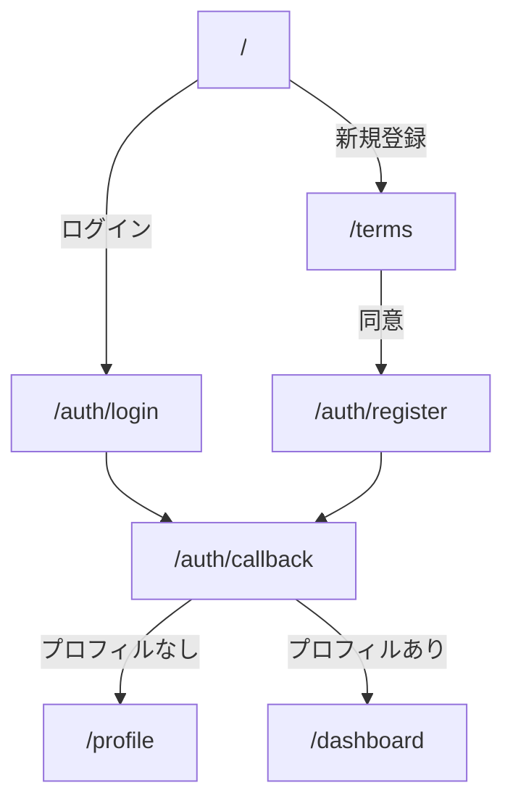

## 認証フローの改善と利用規約ページの分離

### 1. 変更概要

#### 1-1. ページ構成の変更
- **トップページ**（`/page.tsx`）
  - ウェルカムページとしての再設計
  - ログイン/新規登録の2つの明確なパス
  - アプリの主要機能の視覚的な説明

- **利用規約ページ**（`/terms/page.tsx`）
  - 免責事項と利用規約を統合
  - 新規登録フローの一部として位置づけ
  - Cookie による同意状態の管理

#### 1-2. 認証フローの整理


### 2. 実装の詳細

#### 2-1. トップページ（`/page.tsx`）
- グリーンベースのグラデーション背景
- アプリ名とキャッチフレーズの配置
  ```
  タイトル： manmaru
  サブタイトル： AI搭載 妊婦さんの栄養バランスケアアプリ
  タグライン： "あなたと赤ちゃんの健康を、まんまる笑顔に"
  ```
- 主要機能の視覚的説明（アイコン付きカード）
- モバイルファーストのレスポンシブデザイン

#### 2-2. 利用規約ページ（`/terms/page.tsx`）
- shadcn/uiのCardコンポーネントを活用
- 免責事項と利用規約を分けて表示
- 同意ボタンクリック時の処理
  ```typescript
  setCookie('terms_agreed', 'true', {
    maxAge: 60 * 60 * 24 * 365, // 1年間
    path: '/',
  })
  ```

#### 2-3. ミドルウェアの更新（`middleware.ts`）
- パスの種類を明確に定義
  ```typescript
  const PROTECTED_PATHS = ['/dashboard', '/profile', '/meals']
  const AUTH_PATHS = ['/auth/login', '/auth/register', '/terms']
  const PUBLIC_PATHS = ['/terms']
  ```
- 認証状態に応じたリダイレクト制御
- プロフィール状態による分岐処理

### 3. 技術的な注意点

#### 3-1. 依存関係
- `cookies-next`パッケージを追加
  ```bash
  npm install cookies-next
  ```

#### 3-2. セキュリティ考慮事項
- 利用規約同意のCookieは改ざん可能
  - 重要な処理には使用しない
  - あくまでUX向上のための補助的な利用

#### 3-3. パフォーマンス最適化
- 画像・アイコンはSVGを使用
- Tailwindの最適化クラスを活用
- コンポーネントの適切な分割

### 4. 残作業・今後の課題

1. **エラーハンドリング**
   - 各種リダイレクト時のエラー表示
   - ネットワークエラー時の対応

2. **UX改善**
   - ローディング状態の表示
   - トランジションアニメーション

3. **テスト**
   - 認証フローのE2Eテスト
   - 各種エッジケースの確認

4. **アナリティクス**
   - 新規登録導線の計測設定
   - 利用規約同意率の計測

### 5. 関連ドキュメント

- ユーザーストーリー：`/docs/requirements/user-story-login.md`
- デイリーレポート：`/docs/reports/2025-02-20-daily-report.md`

---

## コードレビューのポイント

1. **セキュリティ**
   - 認証状態の適切な確認
   - リダイレクト処理の安全性

2. **UX**
   - モバイル表示の最適化
   - エラーメッセージの分かりやすさ

3. **保守性**
   - コンポーネントの責務分離
   - 型定義の適切さ

4. **パフォーマンス**
   - 不要な再レンダリングの防止
   - 適切なキャッシュ制御