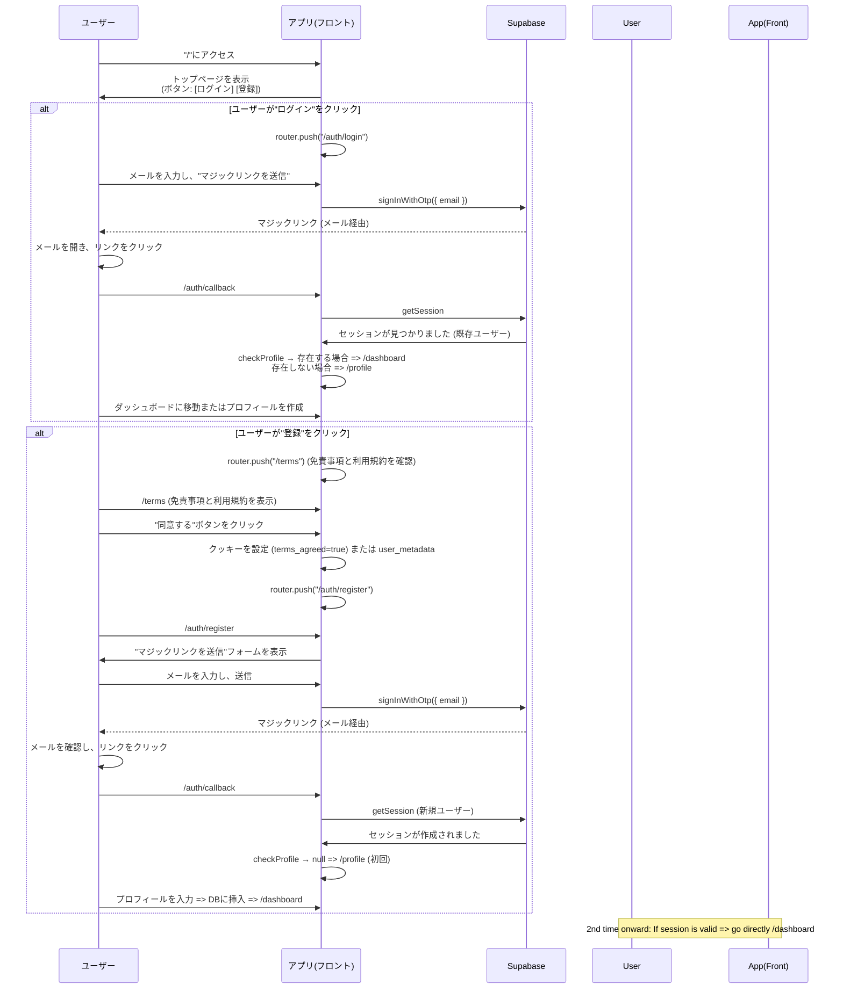

```mermaid
sequenceDiagram
    participant ユーザー
    participant アプリ(フロント)
    participant Supabase

    ユーザー->>アプリ(フロント): "/"にアクセス
    アプリ(フロント)->>ユーザー: トップページを表示<br>(ボタン: [ログイン] [登録])

    alt ユーザーが"ログイン"をクリック
        アプリ(フロント)->>アプリ(フロント): router.push("/auth/login")
        ユーザー->>アプリ(フロント): メールを入力し、"マジックリンクを送信"
        アプリ(フロント)->>Supabase: signInWithOtp({ email })
        Supabase-->>ユーザー: マジックリンク (メール経由)
        ユーザー->>ユーザー: メールを開き、リンクをクリック
        ユーザー->>アプリ(フロント): /auth/callback
        アプリ(フロント)->>Supabase: getSession
        Supabase->>アプリ(フロント): セッションが見つかりました (既存ユーザー)
        アプリ(フロント)->>アプリ(フロント): checkProfile → 存在する場合 => /dashboard<br>存在しない場合 => /profile
        ユーザー->>アプリ(フロント): ダッシュボードに移動またはプロフィールを作成
    end

    alt ユーザーが"登録"をクリック
        アプリ(フロント)->>アプリ(フロント): router.push("/terms") (免責事項と利用規約を確認)
        ユーザー->>アプリ(フロント): /terms (免責事項と利用規約を表示)
        ユーザー->>アプリ(フロント): "同意する"ボタンをクリック
        アプリ(フロント)->>アプリ(フロント): クッキーを設定 (terms_agreed=true) または user_metadata
        アプリ(フロント)->>アプリ(フロント): router.push("/auth/register")

        ユーザー->>アプリ(フロント): /auth/register
        アプリ(フロント)->>ユーザー: "マジックリンクを送信"フォームを表示
        ユーザー->>アプリ(フロント): メールを入力し、送信
        アプリ(フロント)->>Supabase: signInWithOtp({ email })
        Supabase-->>ユーザー: マジックリンク (メール経由)
        ユーザー->>ユーザー: メールを確認し、リンクをクリック
        ユーザー->>アプリ(フロント): /auth/callback
        アプリ(フロント)->>Supabase: getSession (新規ユーザー)
        Supabase->>アプリ(フロント): セッションが作成されました
        アプリ(フロント)->>アプリ(フロント): checkProfile → null => /profile (初回)
        ユーザー->>アプリ(フロント): プロフィールを入力 => DBに挿入 => /dashboard
    end

    Note over User, App(Front): 2nd time onward: If session is valid => go directly /dashboard

```
