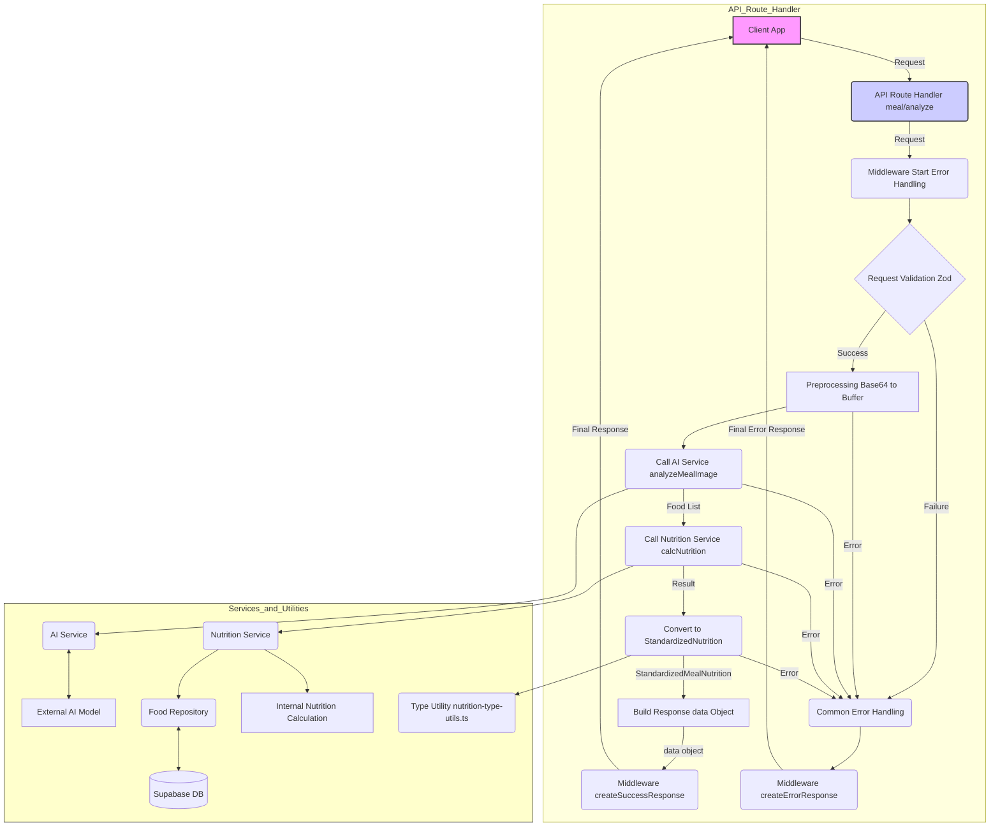

`/api/v2/meal/analyze` API における栄養素計算の処理の流れと、各層（レイヤー）の役割を詳細に解説します。

**1. クライアント (Client App)**

*   ユーザーが操作するフロントエンドアプリケーション（Webブラウザやスマホアプリ）です。
*   食事の画像データなどを API リクエストとしてサーバーに送信します。これが処理の起点となります。

**2. API Route Handler (meal/analyze)**

*   Next.js の API ルート (`src/app/api/v2/meal/analyze/route.ts`) で定義された関数です。リクエストを受け取り、レスポンスを返すまでの **一連の処理を統括・調整 (オーケストレーション) するコントローラー** の役割を担います。
*   具体的な処理の流れは以下の通りです。
    *   **Middleware Start (Error Handling):** リクエストはまず `withErrorHandling` ミドルウェア (`src/lib/api/middleware.ts`) によってラップされます。これにより、以降の処理でエラーが発生した場合でも、後述する共通エラーハンドリングを通じて統一されたエラーレスポンスが返るようになります。
    *   **Request Validation (Zod):** 受け取ったリクエストデータが正しい形式か (例: `image` フィールドが存在するか) を Zod スキーマ (`requestSchema`) を使って検証します。不正な場合はエラーとなります。
    *   **Preprocessing (Base64 to Buffer):** 送られてきた Base64 エンコードされた画像文字列を、AI サービスが処理できるバイナリ形式 (`Buffer`) に変換します。
    *   **Call AI Service (analyzeMealImage):** 変換した画像データを `AIService` (`src/lib/ai/ai-service-impl.ts` など) に渡し、画像解析を依頼します。AI サービスは外部 AI モデル (Gemini など) と連携し、画像から食品名のリストとその量（テキスト形式）を特定して返します。
    *   **Call Nutrition Service (calcNutrition):** AI が返した食品名リストを `NutritionService` (`src/lib/nutrition/nutrition-service-impl.ts` など) に渡します。Nutrition Service は栄養計算のコアロジックを実行します。内部では `FoodRepository` を使ってデータベースから食品情報を取得し、最終的に**レガシー形式の `NutritionData` を含む計算結果**を返します。
    *   **Convert to StandardizedNutrition:** Nutrition Service から受け取ったレガシー形式の `NutritionData` を、型ユーティリティ (`src/lib/nutrition/nutrition-type-utils.ts`) の `convertToStandardizedNutrition` 関数を使って、**新しい標準形式 `StandardizedMealNutrition` に変換**します。
    *   **Build Response data Object:** 標準化された栄養データ (`StandardizedMealNutrition`)、後方互換性のためのレガシーデータ (`NutritionData`)、AI が解析した食品リストなど、クライアントに返したい情報をまとめたオブジェクト (これが最終レスポンスの `data` 部分になる) を構築します。
    *   **Middleware createSuccessResponse:** 構築した `data` オブジェクトを `withErrorHandling` ミドルウェアに返します。ミドルウェアは `createSuccessResponse` 関数 (`src/lib/api/response.ts`) を呼び出し、最終的な API レスポンス形式 (`{ success: true, data: {...}, meta: {...} }`) を組み立ててクライアントに返します。

**3. エラーハンドリング (Common Error Handling & Middleware)**

*   上記の Validation, Preprocessing, AI Service Call, Nutrition Service Call, Type Conversion のいずれかのステップでエラーが発生した場合、処理は共通エラーハンドリングに移ります。
*   エラーは `AppError` 形式に正規化され、`withErrorHandling` ミドルウェア内の `catch` ブロックで捕捉されます。
*   ミドルウェアは `createErrorResponse` 関数を呼び出し、統一されたエラーレスポンス形式 (`{ success: false, error: {...}, meta: {...} }`) を組み立ててクライアントに返します。

**4. Services and Utilities (バックエンドのコアロジック)**

*   API Route Handler から呼び出される、より具体的な処理を担当するモジュール群です。
    *   **AI Service (AISvc):** 外部の AI モデルと通信し、画像から食品情報を抽出する責務を持ちます。
    *   **Nutrition Service (NutritionSvc):** 栄養計算のビジネスロジックを担当します。与えられた食品リストに基づいて、データベース情報 (Food Repository 経由) を参照しながら栄養価を計算します。
    *   **Food Repository (FoodRepo):** データベース (Supabase DB) とのやり取りを抽象化する層です。食品情報の取得など、データベースへのクエリ発行を担当します。
    *   **Type Utility (TypeUtils):** データ形式の変換 (`NutritionData` ⇔ `StandardizedMealNutrition`) など、型に関連する補助的な機能を提供します。

**層の役割分担:**

*   **API Route Handler:** UI (クライアント) とビジネスロジック (Service) の間の **接着剤**。リクエストを受け付け、適切な Service を呼び出し、結果を整形して返す。複雑なロジックは持たず、処理の調整役に徹する。
*   **Service (AI, Nutrition):** アプリケーションの**コアとなるビジネスロジック**を実装する。特定のドメイン（AI解析、栄養計算）に関する責任を持つ。
*   **Repository (Food):** **データ永続化**に関する責任を持つ。データベースの種類や実装の詳細を隠蔽する。
*   **Utility:** 特定のドメインに依存しない、**横断的な機能**（型変換、バリデーションなど）を提供する。

**栄養データの流れ:**

1.  AI Service が食品名を返す
2.  Nutrition Service が食品名から DB を参照し `NutritionData` (レガシー) を計算
3.  API Route Handler が Type Utility を使って `NutritionData` → `StandardizedMealNutrition` (標準) に変換
4.  API Route Handler はレスポンスに `nutrition` (標準) と `legacyNutrition` (レガシー) の両方を含めて返す

