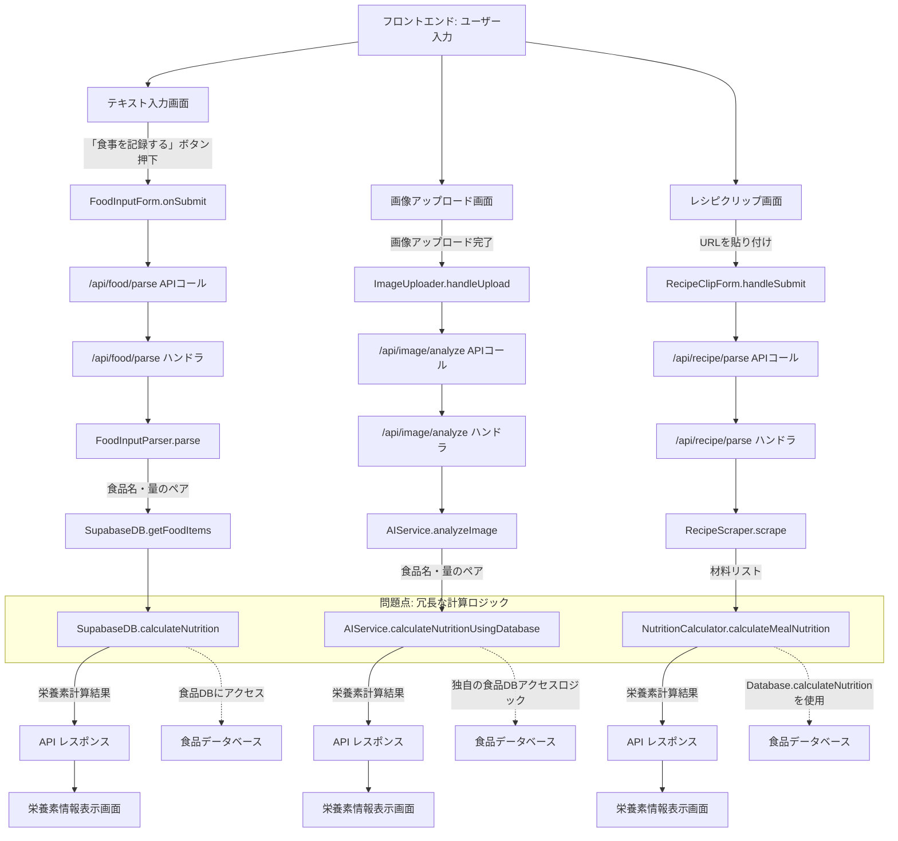
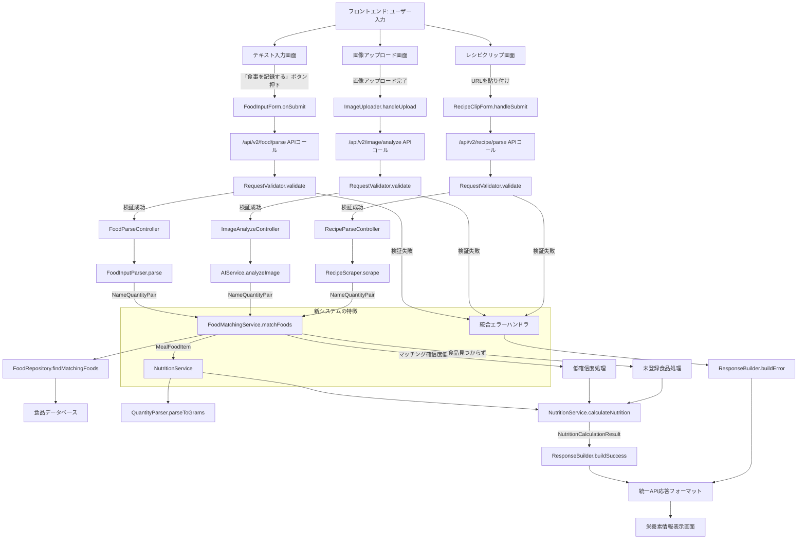
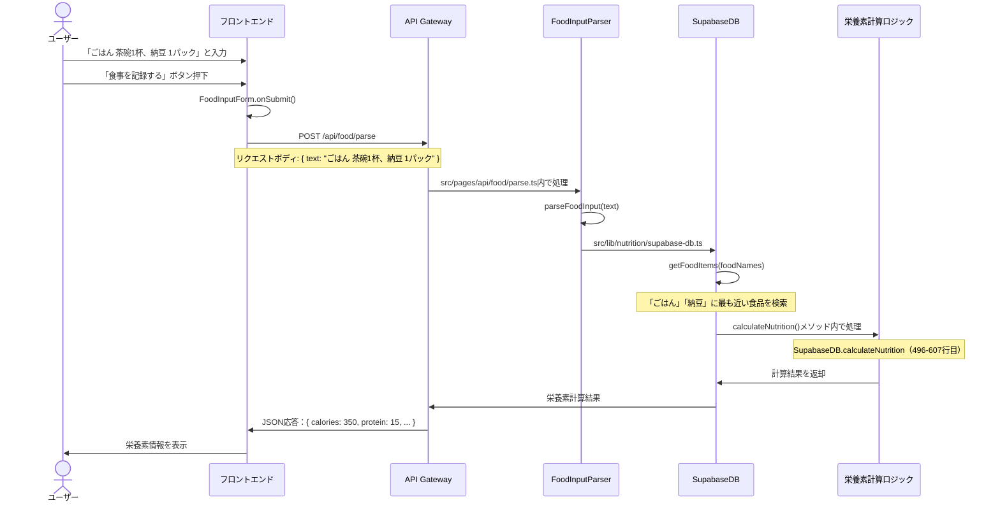
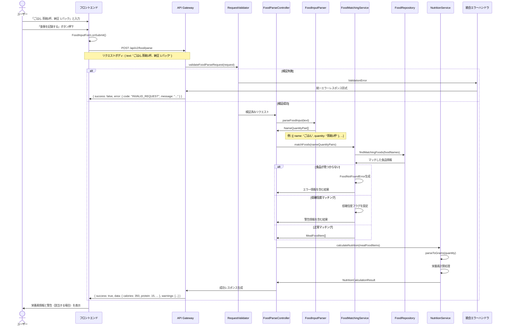

旧システム

```mermaid
flowchart TD
    %% フロントエンド部分
    FE_START[フロントエンド: ユーザー入力] --> FE_TEXT[テキスト入力画面]
    FE_START --> FE_IMAGE[画像アップロード画面] 
    FE_START --> FE_RECIPE[レシピクリップ画面]
    
    %% テキスト入力フロー
    FE_TEXT --> |「食事を記録する」ボタン押下| FE_SUBMIT_TEXT[FoodInputForm.onSubmit]
    FE_SUBMIT_TEXT --> API_TEXT["/api/food/parse" APIコール]
    
    %% 画像入力フロー
    FE_IMAGE --> |画像アップロード完了| FE_SUBMIT_IMAGE[ImageUploader.handleUpload]
    FE_SUBMIT_IMAGE --> API_IMAGE["/api/image/analyze" APIコール]
    
    %% レシピフロー
    FE_RECIPE --> |URLを貼り付け| FE_SUBMIT_RECIPE[RecipeClipForm.handleSubmit]
    FE_SUBMIT_RECIPE --> API_RECIPE["/api/recipe/parse" APIコール]
    
    %% バックエンド: テキスト解析API
    API_TEXT --> BE_TEXT["/api/food/parse" ハンドラ]
    BE_TEXT --> PARSE_TEXT[FoodInputParser.parse]
    PARSE_TEXT --> |食品名・量のペア| DB_FOOD_SEARCH1[SupabaseDB.getFoodItems]
    DB_FOOD_SEARCH1 --> CALC1[SupabaseDB.calculateNutrition]
    CALC1 --> |栄養素計算結果| API_RESP1[API レスポンス]
    
    %% バックエンド: 画像解析API
    API_IMAGE --> BE_IMAGE["/api/image/analyze" ハンドラ]
    BE_IMAGE --> AI_ANALYZE[AIService.analyzeImage]
    AI_ANALYZE --> |食品名・量のペア| AI_CALC[AIService.calculateNutritionUsingDatabase]
    AI_CALC --> |栄養素計算結果| API_RESP2[API レスポンス]
    
    %% バックエンド: レシピ解析API
    API_RECIPE --> BE_RECIPE["/api/recipe/parse" ハンドラ]
    BE_RECIPE --> SCRAPE[RecipeScraper.scrape]
    SCRAPE --> |材料リスト| MEAL_CALC[NutritionCalculator.calculateMealNutrition]
    MEAL_CALC --> |栄養素計算結果| API_RESP3[API レスポンス]
    
    %% 各計算ロジック内のデータベースアクセス（冗長性の原因）
    CALC1 -.-> |食品DBにアクセス| FOOD_DB1[食品データベース]
    AI_CALC -.-> |独自の食品DBアクセスロジック| FOOD_DB2[食品データベース]
    MEAL_CALC -.-> |Database.calculateNutritionを使用| FOOD_DB3[食品データベース]
    
    %% レスポンスからフロントエンド表示へ
    API_RESP1 --> FE_DISPLAY1[栄養素情報表示画面]
    API_RESP2 --> FE_DISPLAY2[栄養素情報表示画面]
    API_RESP3 --> FE_DISPLAY3[栄養素情報表示画面]
    
    %% 問題点を図示
    subgraph "問題点: 冗長な計算ロジック"
        CALC1
        AI_CALC
        MEAL_CALC
    end
```
新システム

```mermaid
flowchart TD
    %% フロントエンド部分
    FE_START[フロントエンド: ユーザー入力] --> FE_TEXT[テキスト入力画面]
    FE_START --> FE_IMAGE[画像アップロード画面] 
    FE_START --> FE_RECIPE[レシピクリップ画面]

    %% テキスト入力フロー
    FE_TEXT --> |「食事を記録する」ボタン押下| FE_SUBMIT_TEXT[FoodInputForm.onSubmit]
    FE_SUBMIT_TEXT --> API_TEXT["/api/v2/food/parse" APIコール]

    %% 画像入力フロー
    FE_IMAGE --> |画像アップロード完了| FE_SUBMIT_IMAGE[ImageUploader.handleUpload]
    FE_SUBMIT_IMAGE --> API_IMAGE["/api/v2/image/analyze" APIコール]

    %% レシピフロー
    FE_RECIPE --> |URLを貼り付け| FE_SUBMIT_RECIPE[RecipeClipForm.handleSubmit]
    FE_SUBMIT_RECIPE --> API_RECIPE["/api/v2/recipe/parse" APIコール]

    %% 入力検証レイヤー（共通）
    API_TEXT --> VALIDATE_TEXT[RequestValidator.validate]
    API_IMAGE --> VALIDATE_IMAGE[RequestValidator.validate]
    API_RECIPE --> VALIDATE_RECIPE[RequestValidator.validate]

    %% エラーハンドリング（共通）
    VALIDATE_TEXT --> |検証成功| BE_TEXT[FoodParseController]
    VALIDATE_TEXT --> |検証失敗| ERROR_HANDLER[統合エラーハンドラ]
    VALIDATE_IMAGE --> |検証成功| BE_IMAGE[ImageAnalyzeController]
    VALIDATE_IMAGE --> |検証失敗| ERROR_HANDLER
    VALIDATE_RECIPE --> |検証成功| BE_RECIPE[RecipeParseController]
    VALIDATE_RECIPE --> |検証失敗| ERROR_HANDLER

    %% 入力解析レイヤー
    BE_TEXT --> PARSE_TEXT[FoodInputParser.parse]
    BE_IMAGE --> AI_ANALYZE[AIService.analyzeImage]
    BE_RECIPE --> SCRAPE[RecipeScraper.scrape]

    %% 統一マッチングレイヤー
    PARSE_TEXT --> |"NameQuantityPair"| FOOD_MATCH[FoodMatchingService.matchFoods]
    AI_ANALYZE --> |"NameQuantityPair"| FOOD_MATCH
    SCRAPE --> |"NameQuantityPair"| FOOD_MATCH

    %% 食品リポジトリアクセス
    FOOD_MATCH --> REPO[FoodRepository.findMatchingFoods]
    REPO --> FOOD_DB[食品データベース]

    %% 統一栄養計算レイヤー
    FOOD_MATCH --> |"MealFoodItem"| NUTRITION_SVC[NutritionService]
    NUTRITION_SVC --> QUANTITY_PARSE[QuantityParser.parseToGrams]
    NUTRITION_SVC --> CALC[NutritionService.calculateNutrition]

    %% レスポンス生成
    CALC --> |"NutritionCalculationResult"| RESPONSE_BUILDER[ResponseBuilder.buildSuccess]
    ERROR_HANDLER --> RESPONSE_BUILDER_ERR[ResponseBuilder.buildError]

    %% API応答
    RESPONSE_BUILDER --> API_RESP[統一API応答フォーマット]
    RESPONSE_BUILDER_ERR --> API_RESP

    %% フロントエンド表示
    API_RESP --> FE_DISPLAY[栄養素情報表示画面]

    %% 低確信度・不明食品処理
    FOOD_MATCH --> |マッチング確信度低| LOW_CONF[低確信度処理]
    FOOD_MATCH --> |食品見つからず| NOT_FOUND[未登録食品処理]
    LOW_CONF --> CALC
    NOT_FOUND --> CALC

    %% 新システムの特徴
    subgraph "新システムの特徴"
        FOOD_MATCH
        NUTRITION_SVC
        ERROR_HANDLER
    end
```
旧システム

```mermaid
sequenceDiagram
    actor User as ユーザー
    participant FE as フロントエンド
    participant API as API Gateway
    participant Parser as FoodInputParser
    participant DB as SupabaseDB
    participant NutriCalc as 栄養素計算ロジック
    
    User->>FE: 「ごはん 茶碗1杯、納豆 1パック」と入力
    User->>FE: 「食事を記録する」ボタン押下
    FE->>FE: FoodInputForm.onSubmit()
    FE->>API: POST /api/food/parse
    Note over FE,API: リクエストボディ: { text: "ごはん 茶碗1杯、納豆 1パック" }
    
    API->>Parser: src/pages/api/food/parse.ts内で処理
    Parser->>Parser: parseFoodInput(text)
    Parser->>DB: src/lib/nutrition/supabase-db.ts
    DB->>DB: getFoodItems(foodNames)
    Note over DB: 「ごはん」「納豆」に最も近い食品を検索
    
    DB->>NutriCalc: calculateNutrition()メソッド内で処理
    Note over NutriCalc: SupabaseDB.calculateNutrition（496-607行目）
    NutriCalc->>DB: 計算結果を返却
    
    DB->>API: 栄養素計算結果
    API->>FE: JSON応答：{ calories: 350, protein: 15, ... }
    FE->>User: 栄養素情報を表示
```
新システム

```mermaid
sequenceDiagram
    actor User as ユーザー
    participant FE as フロントエンド
    participant API as API Gateway
    participant Validator as RequestValidator
    participant Controller as FoodParseController
    participant Parser as FoodInputParser
    participant Matcher as FoodMatchingService
    participant Repo as FoodRepository
    participant NutriSvc as NutritionService
    participant ErrorHandler as 統合エラーハンドラ
    
    User->>FE: 「ごはん 茶碗1杯、納豆 1パック」と入力
    User->>FE: 「食事を記録する」ボタン押下
    FE->>FE: FoodInputForm.onSubmit()
    FE->>API: POST /api/v2/food/parse
    Note over FE,API: リクエストボディ: { text: "ごはん 茶碗1杯、納豆 1パック" }
    
    API->>Validator: validateFoodParseRequest(request)
    alt 検証失敗
        Validator->>ErrorHandler: ValidationError
        ErrorHandler->>API: 統一エラーレスポンス形式
        API->>FE: { success: false, error: { code: "INVALID_REQUEST", message: "..." } }
    else 検証成功
        Validator->>Controller: 検証済みリクエスト
        Controller->>Parser: parseFoodInput(text)
        Parser->>Controller: NameQuantityPair[] 
        Note over Parser: 例: [{ name: "ごはん", quantity: "茶碗1杯" }, ...]
        
        Controller->>Matcher: matchFoods(nameQuantityPairs)
        Matcher->>Repo: findMatchingFoods(foodNames)
        Repo->>Matcher: マッチした食品情報
        
        alt 食品が見つからない
            Matcher->>Matcher: FoodNotFoundError生成
            Matcher->>Controller: エラー情報を含む結果
        else 低確信度マッチング
            Matcher->>Matcher: 低確信度フラグを設定
            Matcher->>Controller: 警告情報を含む結果
        else 正常マッチング
            Matcher->>Controller: MealFoodItem[]
        end
        
        Controller->>NutriSvc: calculateNutrition(mealFoodItems)
        NutriSvc->>NutriSvc: parseToGrams(quantity)
        NutriSvc->>NutriSvc: 栄養素計算処理
        NutriSvc->>Controller: NutritionCalculationResult
        
        Controller->>API: 成功レスポンス生成
        API->>FE: { success: true, data: { calories: 350, protein: 15, ... }, warnings: [...] }
    end
    
    FE->>User: 栄養素情報と警告（該当する場合）を表示
```